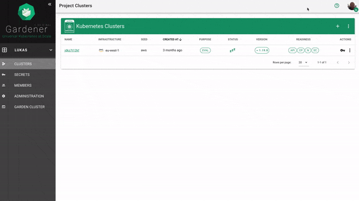

# Gardener Dashboard

## Demo

## Documentation

[Gardener Dashboard Documentation](./docs/README.md)

## License
[Apache License 2.0](./LICENSES/Apache-2.0.txt)

Copyright 2020 The Gardener Authors
