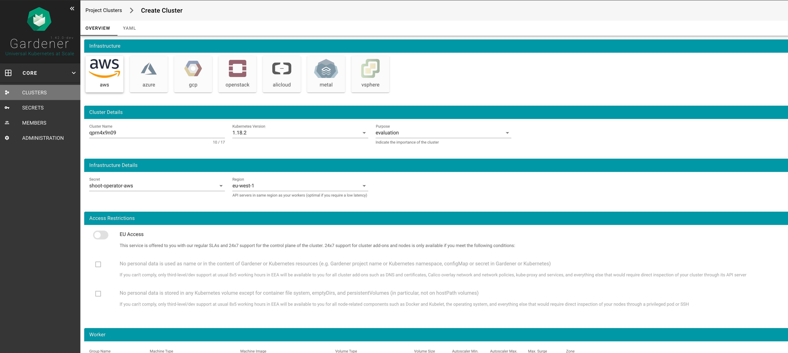
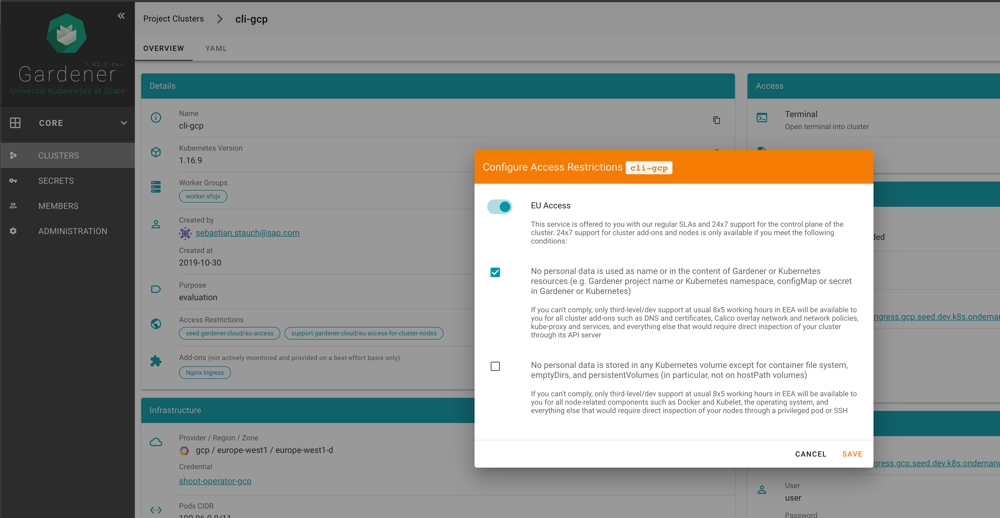

# Access Restrictions

The dashboard can be configured with access restrictions.



Access restrictions are shown for regions that have a matching label in the `CloudProfile`
```yaml
  regions:
  - name: pangaea-north-1
    zones:
    - name: pangaea-north-1a
    - name: pangaea-north-1b
    - name: pangaea-north-1c
    labels:
      seed.gardener.cloud/eu-access: "true"
```

- If the user selects the access restriction, `spec.seedSelector.matchLabels[key]` will be set.
- When selecting an option, `metadata.annotations[optionKey]` will be set.

The value that is set depends on the configuration. See _2._ under _Configuration_ section below.

```yaml
apiVersion: core.gardener.cloud/v1beta1
kind: Shoot
metadata:
  annotations:
    support.gardener.cloud/eu-access-for-cluster-addons: "true"
    support.gardener.cloud/eu-access-for-cluster-nodes: "true"
  ...
spec:
  seedSelector:
    matchLabels:
      seed.gardener.cloud/eu-access: "true"
```

In order for the shoot (with enabled access restriction) to be scheduled on a seed, the seed needs to have the label set. E.g.
```yaml
apiVersion: core.gardener.cloud/v1beta1
kind: Seed
metadata:
  labels:
    seed.gardener.cloud/eu-access: "true"
...
```



**Configuration**
As gardener administrator:
1. you can control the visibility of the chips with the `accessRestriction.items[].display.visibleIf` and `accessRestriction.items[].options[].display.visibleIf` property. E.g. in this example the access restriction chip is shown if the value is true and the option is shown if the value is false.
2. you can control the value of the input field (switch / checkbox) with the `accessRestriction.items[].input.inverted` and `accessRestriction.items[].options[].input.inverted` property. Setting the `inverted` property to `true` will invert the value. That means that when selecting the input field the value will be`'false'` instead of `'true'`.
3. you can configure the text that is displayed when no access restriction options are available by setting `accessRestriction.noItemsText`
example `values.yaml`:
```yaml
accessRestriction:
  noItemsText: No access restriction options available for region {region} and cloud profile {cloudProfile}
  items:
  - key: seed.gardener.cloud/eu-access
    display:
      visibleIf: true
      # title: foo # optional title, if not defined key will be used
      # description: bar # optional description displayed in a tooltip
    input:
      title: EU Access
      description: |
        This service is offered to you with our regular SLAs and 24x7 support for the control plane of the cluster. 24x7 support for cluster add-ons and nodes is only available if you meet the following conditions:
    options:
    - key: support.gardener.cloud/eu-access-for-cluster-addons
      display:
        visibleIf: false
        # title: bar # optional title, if not defined key will be used
        # description: baz # optional description displayed in a tooltip
      input:
        title: No personal data is used as name or in the content of Gardener or Kubernetes resources (e.g. Gardener project name or Kubernetes namespace, configMap or secret in Gardener or Kubernetes)
        description: |
          If you can't comply, only third-level/dev support at usual 8x5 working hours in EEA will be available to you for all cluster add-ons such as DNS and certificates, Calico overlay network and network policies, kube-proxy and services, and everything else that would require direct inspection of your cluster through its API server
        inverted: true
    - key: support.gardener.cloud/eu-access-for-cluster-nodes
      display:
        visibleIf: false
      input:
        title: No personal data is stored in any Kubernetes volume except for container file system, emptyDirs, and persistentVolumes (in particular, not on hostPath volumes)
        description: |
          If you can't comply, only third-level/dev support at usual 8x5 working hours in EEA will be available to you for all node-related components such as Docker and Kubelet, the operating system, and everything else that would require direct inspection of your nodes through a privileged pod or SSH
        inverted: true
```