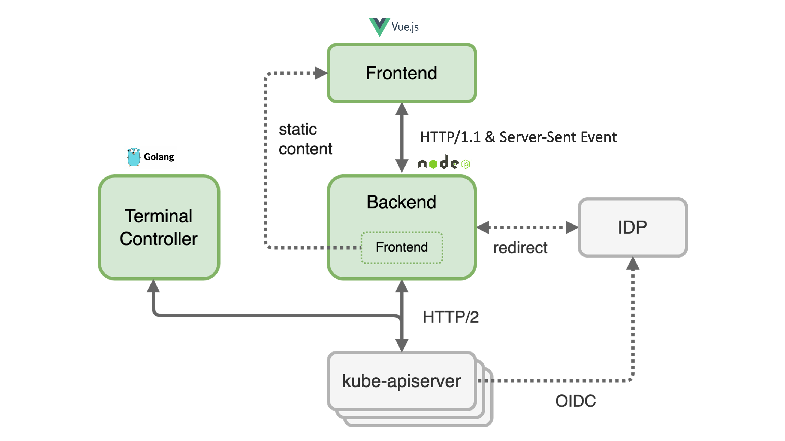
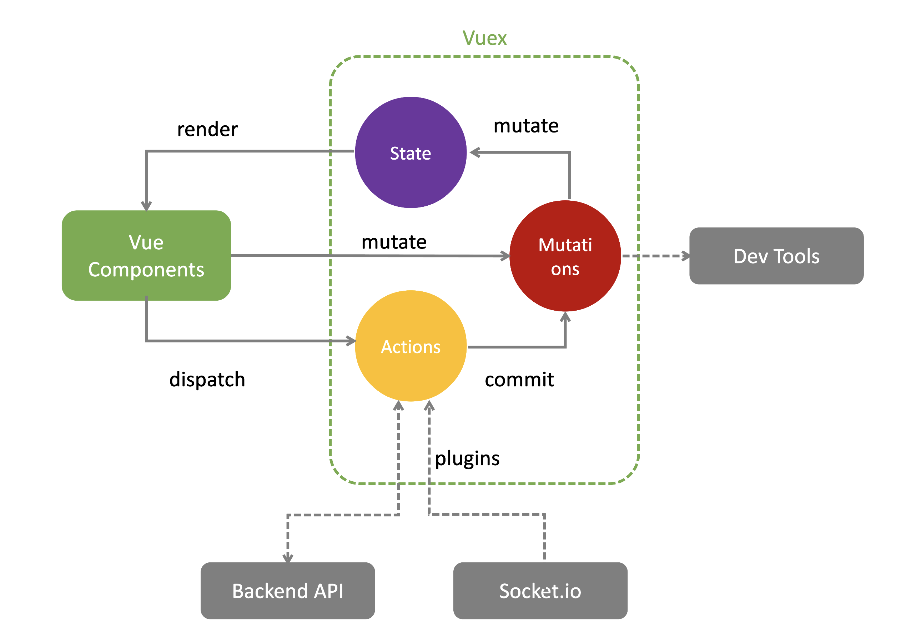
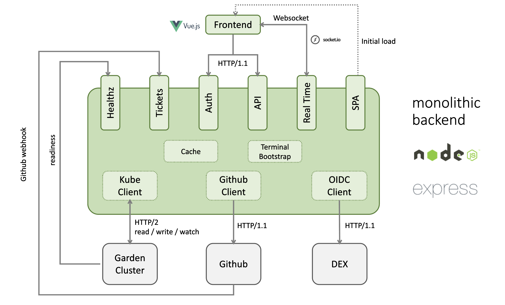
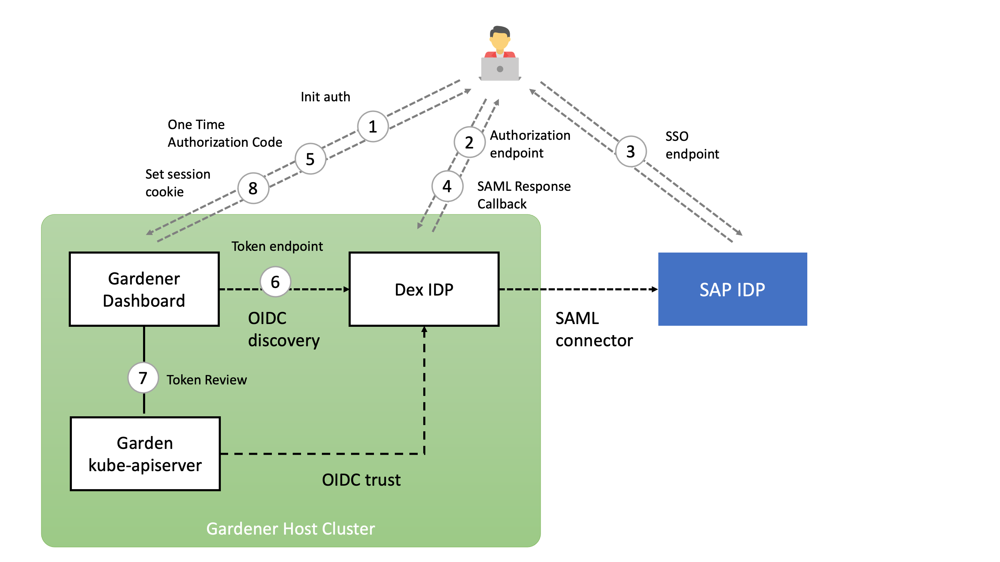

# Dashboard Architecture Overview

## Overview

The dashboard `frontend` is a Single Page Application (SPA) built with [Vue.js](https://vuejs.org/). The dashboard `backend` is a web server built with [Express](http://expressjs.com) and [Node.js](https://nodejs.org/). The `backend` serves the bundled `frontend` as static content. The dashboard uses [Socket.IO](https://socket.io/) to enable real-time, bidirectional and event-based communication between the `frontend` and the `backend`. For the communication from the `backend` to different `kube-apiservers` the http/2 network protocol is used. Authentication at the `apiserver` of the garden cluster is done via JWT tokens. These can either be an ID Token issued by an OpenID Connect Provider or the token of a Kubernetes Service Account.

## Frontend

The dashboard `frontend` consists of many Vue.js single file components that manage their state via a [centralized store](https://vuex.vuejs.org/). The store defines mutations to modify the state synchronously. If several mutations have to be combined or the state in the `backend` has to be modified at the same time, the store provides asynchronous actions to do this job. The synchronization of the data with the `backend` is done by plugins that also use actions.

## Backend

The `backend` is currently a monolithic Node.js application, but it performs several tasks that are actually independent.

* Static web server for the `frontend` single page application
* Forward real time events of the `apiserver` to the `frontend`
* Provide an HTTP API
* Initiate and manage the end user login flow in order to obtain an ID Token
* Bidirectional integration with the GitHub issue management

It is planned to split the `backend` into several independent containers to increase stability and performance.

## Authentication

The following diagram shows the authorization code flow in the Gardener dashboard. When the user clicks the login button, he is redirected to the authorization endpoint of the openid connect provider. In the case of [Dex IDP](https://dexidp.io/), authentication is delegated to the connected IDP. After a successful login, the OIDC provider redirects back to the dashboard `backend` with a one time authorization code. With this code, the dashboard `backend` can now request an ID token for the logged in user. The ID token is encrypted and stored as a secure `httpOnly` session cookie.

