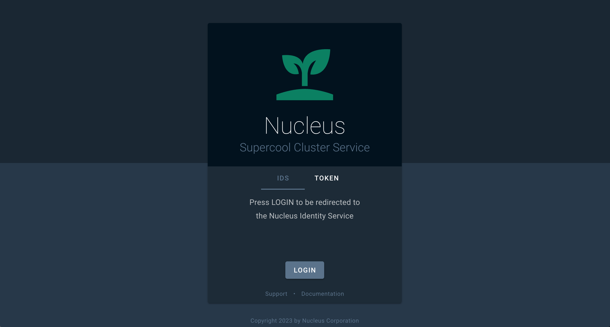
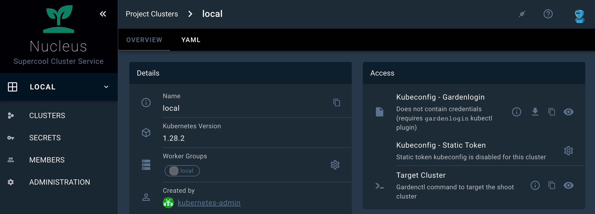
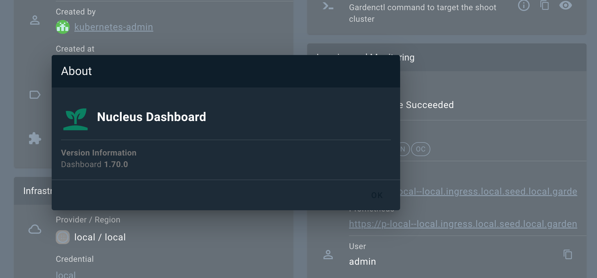

# Theming and Branding

## Motivation
Gardener landscape administrators should have the possibility to change the appearance and the branding of the Gardener Dashboard via configuration without the need to touch the code.

## Branding
It is possible to change the branding of the Gardener Dashboard when using the [helm chart](../../charts/gardener-dashboard) in the `frontendConfig.branding` map. The following configuration properties are supported:

| name | description | default |
| ---- | ----------- | ------- |
| `documentTitle` | Title of the browser window | `Gardener Dashboard` |
| `productName` | Name of the Gardener product | `Gardener` |
| `productTitle` | Title of the Gardener product displayed below the logo. It could also contain information about the specific Gardener instance (e.g. Development, Canary, Live) | `Gardener`  |
| `productTitleSuperscript` | Superscript next to the product title. To supress the superscript set to `false` | Production version (e.g 1.73.1) |
| `productSlogan` | Slogan that is displayed under the product title and on the login page| `Universal Kubernetes at Scale` |
| `productLogoUrl` | URL for the product logo. You can also use the `data:` scheme for development. For production, it is recommended to provide static assets. If you use `branding.assets.productLogo` to configure custom logos and do not provide a custom login template, you can use this configuration to adapt the logo path on the login page. | `/static/assets/logo.svg` |
| `assets` | Map with overrides for dashboard assets (logo and favicons). Each entry accepts a `fileName` and optional `version` that are served from `/static/custom-assets`. | `{}` |
| `teaserHeight` | Height of the teaser in the [GMainNavigation](../../frontend/src/components/GMainNavigation.vue) component | `200` |
| `teaserTemplate` | Custom HTML template to replace to teaser content | refer to [GTeaser](../../frontend/src/components/GTeaser.vue) |
| `loginTeaserHeight` | Height of the login teaser in the [GLogin](../../frontend/src/layouts/GLogin.vue) component | `260` |
| `loginTeaserTemplate` | Custom HTML template to replace to login teaser content | refer to [GLoginTeaser](../../frontend/src/components/GLoginTeaser.vue) |
| `loginFooterHeight` | Height of the login footer in the [GLogin](../../frontend/src/layouts/GLogin.vue) component | `24` |
| `loginFooterTemplate` | Custom HTML template to replace to login footer content | refer to [GLoginFooter](../../frontend/src/components/GLoginFooter.vue) |
| `loginHints` | Links [`{ title: string; href: string; }`](https://vuetifyjs.com/en/api/v-breadcrumbs/#props-items) to product related sites shown below the login button  | `undefined` |
| `oidcLoginTitle` | Title of tabstrip for loginType OIDC | `OIDC` |
| `oidcLoginText` | Text show above the login button on the OIDC tabstrip | `Press Login to be redirected to`<br> `configured OpenID Connect Provider.` |

## Colors
Gardener Dashboard has been built with Vuetify. We use Vuetify's built-in [theming support](https://vuetifyjs.com/en/features/theme/) to centrally configure colors that are used throughout the web application.
Colors can be configured for both light and dark themes. Configuration is done via the helm chart, see the respective theme section there. Colors can be specified as HTML color code (e.g. `#FF0000` for red) or by referencing a color (e.g `grey.darken3` or `shades.white`) from Vuetify's Material Design [Color Pack](https://vuetifyjs.com/en/styles/colors/#javascript-color-pack).

The following colors can be configured:

| name                    | usage|
| ----------------------- |------|
| `primary`               | icons, chips, buttons, popovers, etc. |
| `anchor`                | links |
| `main-background`       | main navigation, login page   |
| `main-navigation-title` | text color on main navigation |
| `toolbar-background`    | background color for toolbars in cards, dialogs, etc. |
| `toolbar-title`         | text color for toolbars in cards, dialogs, etc. |
| `action-button`         | buttons in tables and cards, e.g. cluster details page |
| `info`                  | notification info popups, texts and status tags |
| `success`               | notification success popups, texts and status tags |
| `warning`               | notification warning popups, texts and status tags |
| `error`                 | notification error popups, texts and status tags |
| `unknown`               | status tags with unknown severity |
| ...                     | all other Vuetify theme [colors](https://vuetifyjs.com/en/styles/colors/) |

If you use the helm chart, you can configure those with `frontendConfig.themes.light` for the light theme and `frontendConfig.themes.dark` for the dark theme. The [customization example](#customization-example) below shows a possible custom color theme configuration.

## Logos and Icons

It is also possible to exchange the Dashboard logo and icons. You can either replace the complete asset bundle or configure dedicated overrides for the logo and favicons.

### Replace the complete assets folder (legacy)

You can replace the [assets](../../frontend/public/static/assets) folder when using the [helm chart](../../charts/gardener-dashboard) in the `frontendConfig.assets` map.

Attention: You need to set values for all files as mapping the volume will overwrite all files. It is not possible to exchange single files.

The files have to be encoded as base64 for the chart - to generate the encoded files for the `values.yaml` of the helm chart, you can use the following shorthand with `bash` or `zsh` on Linux systems. If you use macOS, install coreutils with brew (`brew install coreutils`) or remove the `-w0` parameter.

```bash
cat << EOF
  ###
  ### COPY EVERYTHING BELOW THIS LINE
  ###

  assets:
    favicon-16x16.png: |
      $(cat frontend/public/static/assets/favicon-16x16.png | base64 -w0)
    favicon-32x32.png: |
      $(cat frontend/public/static/assets/favicon-32x32.png | base64 -w0)
    favicon-96x96.png: |
      $(cat frontend/public/static/assets/favicon-96x96.png | base64 -w0)
    favicon.ico: |
      $(cat frontend/public/static/assets/favicon.ico | base64 -w0)
    logo.svg: |
      $(cat frontend/public/static/assets/logo.svg | base64 -w0)
EOF
```

Then, swap in the base64 encoded version of your files where needed.

### Override selected assets

To override individual assets without replacing the whole folder, provide the file contents in the `frontendConfig.customAssets` map and reference them via `branding.assets`. The Dashboard serves the files from `/static/custom-assets/<fileName>` and appends the optional `version` query parameter to help with cache busting.

The following asset keys are supported: `productLogo`, `favicon`, `favicon16`, `favicon32`, and `favicon96`.

```yaml
frontendConfig:
  customAssets:
    custom-logo.svg: |
      <base64 encoded file>
    favicon-16x16.png: |
      <base64 encoded file>
  branding:
    assets:
      productLogo:
        fileName: custom-logo.svg
        version: v2
      favicon16:
        fileName: favicon-16x16.png
```

With this configuration the Dashboard rewrites the logo to `/static/custom-assets/custom-logo.svg?v=v2` and the 16×16 favicon to `/static/custom-assets/favicon-16x16.png`. Omitted entries continue to use the defaults from `/static/assets`.

## Customization Example

The following example configuration in `values.yaml` shows most of the possibilities to achieve a custom theming and branding:

```yaml
global:
  dashboard:
    frontendConfig:
      # ...
      branding:
        productName: Nucleus
        productTitle: Nucleus
        productSlogan: Supercool Cluster Service
        teaserHeight: 160
        teaserTemplate: |
          <div
            class="text-center px-2"
          >
            <a
              href="/"
              class="text-decoration-none"
            >
              
              <div
                class="font-weight-thin text-grey-lighten-4"
                style="font-size: 32px; line-height: 32px; letter-spacing: 2px;"
              >
                {{ productTitle }}
              </div>
              <div class="text-body-1 font-weight-normal text-primary mt-1">
                {{ productSlogan }}
              </div>
            </a>
          </div>
        loginTeaserHeight: 296
        loginTeaserTemplate: |
          <div
            class="d-flex flex-column align-center justify-center bg-main-background-darken-1 pa-3"
            style="min-height: {{ minHeight }}px"
          >
            
            <div class="text-h3 text-center font-weight-thin text-white mt-4">
              {{ productTitle }}
            </div>
            <div class="text-h5 text-center font-weight-light text-primary mt-1">
              {{ productSlogan }}
            </div>
          </div>
        loginFooterTemplate: |
          <div class="text-anchor text-caption">
            Copyright 2023 by Nucleus Corporation
          </div>
        loginHints:
          - title: Support
            href: https://gardener.cloud
          - title: Documentation
            href: https://gardener.cloud/docs
        oidcLoginTitle: IDS
        oidcLoginText: Press LOGIN to be redirected to the Nucleus Identity Service.
      themes:
        light:
          primary: '#354a5f'
          anchor: '#5b738b'
          main-background: '#354a5f'
          main-navigation-title: '#f5f6f7'
          toolbar-background: '#354a5f'
          toolbar-title: '#f5f6f7'
          action-button: '#354a5f'
        dark:
          primary: '#5b738b'
          anchor: '#5b738b'
          background: '#273849'
          surface: '#1d2b37'
          main-background: '#1a2733'
          main-navigation-title: '#f5f6f7'
          toolbar-background: '#0e1e2a'
          toolbar-title: '#f5f6f7'
          action-button: '#5b738b'
      assets:
        favicon-16x16.png: |
          iVBORw0KGgoAAAANSUhEUgAAABAAAAAQCAMAAAAoLQ9TAAAABGdBTUEAALGPC/xhBQAAACBjSFJNAAB6JgAAgIQAAPoAAACA6AAAdTAAAOpgAAA6mAAAF3CculE8AAABHVBMVEUAAAALgGILgWIKgGILgGILgGILgGILgGILgGILgGILgGILgGILgGILgGILgGILgGILgGILgGILgGILgGILgGILgGILgGILgGILgGILgGILgGILgGILgGILgGILgGILgGILgGILgGILgGILgGILgGILgGILgGILgGILgGILgGILgGILgGILgGIMgGILgGILgGILgGILgGILgGILgGILgGILgGILgGILgGILgGILgGILgGILgGILgGILgGILgGILgGILgGILgGILgGILgGILgGILgGILgGILgGILgGILgGILgGILgGILgGILgGILgGILgGIKgGILgGILgGIKgGILgGILgGILgGILgGILgGILgGILgGILgGILgGILgGL///8Vq54LAAAAXXRSTlMAAAAAFmu96Pv0TRQ5NB0FLLn67j1X8fDdnSoR3CJC9cZx9/7ZtAna9rvFe28Cl552ZLDUIS7X5UnfVOrrOKS+Q7/Kz61IAwQKC8gVEwYIyQxgZQYCVn9+IFjR7/wm8JKCAAAAAWJLR0ReBNZhuwAAAAd0SU1FB+cKCgkYLrOE10YAAADMSURBVBjTXY7XUsIAFETvxhJQQwlEEhUlCEizVxANCIoQwAIobf//NyTjMDqcp5192D0ivwCra+uqz78h2NzSAkEgFNZJRqICYztmWju7YXrsxQX7B/OQsJOHqRiZzggCR8zmVJX5QpYsQnB8Qp6e+fTzC/LyCqLg+oa3d6lS+Z4VA/AOHx6dau3JqDeeX+ApKGi+tpy22+lCkYVWz3l7X5E/0KstFc2Pz/6iwMDVhvbXtz3U3MF8dDS2JtOZpz2bTqzxSEyd/9BN4RI/8jsrfdR558kAAAAldEVYdGRhdGU6Y3JlYXRlADIwMjMtMTAtMTBUMDk6MjQ6MzMrMDA6MDC+UDWaAAAAJXRFWHRkYXRlOm1vZGlmeQAyMDIzLTEwLTEwVDA5OjI0OjMzKzAwOjAwzw2NJgAAABJ0RVh0ZXhpZjpFeGlmT2Zmc2V0ADI2UxuiZQAAABh0RVh0ZXhpZjpQaXhlbFhEaW1lbnNpb24AMTUwO0W0KAAAABh0RVh0ZXhpZjpQaXhlbFlEaW1lbnNpb24AMTUwpkpVXgAAACB0RVh0c29mdHdhcmUAaHR0cHM6Ly9pbWFnZW1hZ2ljay5vcme8zx2dAAAAGHRFWHRUaHVtYjo6RG9jdW1lbnQ6OlBhZ2VzADGn/7svAAAAGHRFWHRUaHVtYjo6SW1hZ2U6OkhlaWdodAAxOTJAXXFVAAAAF3RFWHRUaHVtYjo6SW1hZ2U6OldpZHRoADE5MtOsIQgAAAAZdEVYdFRodW1iOjpNaW1ldHlwZQBpbWFnZS9wbmc/slZOAAAAF3RFWHRUaHVtYjo6TVRpbWUAMTY5NjkyOTg3M4YMipUAAAAPdEVYdFRodW1iOjpTaXplADBCQpSiPuwAAABWdEVYdFRodW1iOjpVUkkAZmlsZTovLy9tbnRsb2cvZmF2aWNvbnMvMjAyMy0xMC0xMC9kNzEyMWM2YzM2OTg3NmQ0MGUxY2EyMjVlYjg3MGZjYi5pY28ucG5nU19BKAAAAABJRU5ErkJggg==
        favicon-32x32.png: |
          iVBORw0KGgoAAAANSUhEUgAAACAAAAAgCAMAAABEpIrGAAAABGdBTUEAALGPC/xhBQAAACBjSFJNAAB6JgAAgIQAAPoAAACA6AAAdTAAAOpgAAA6mAAAF3CculE8AAACTFBMVEUAAAALgWIKil4LgGIKgGEMf2MNgGIMgGILgGEKgWEIhVwGgl8JgVwMgGMKgGMNgGEKf2EMgWMMf2ILhmILhGIKjFwHgmYMf2EKgWMGgGIKgGIIg2UAgGMCkGINfGIMfGILfmELfWELgGILgGILgGILgGILgGILgGILgGILgGILgGILgGILgGILgGILgGILgGIKgGILgGILgGILgGILgGILgGILgGILgGILgGILgGILgGILgWELgGILgGILgGILgGILgGILgGILgGILgGILgGILgGILgGIMgGILgGILgGILgGILgGILgGILgGILgGILgGILgGILgGILgGILgGILgGIKgWELgGILgGILgGIMgmILgGILgGILgGILgGILgGILgGILgGILgGILgGILgGILgGILgGILgGILgGILgGILgGILgGILgGILgGILgGILgGILgGILgGILgGILgGILgGILgGILgGILgGILgGILgGIKg2ALgGILgGILgGILgGILgGILgGILgGILgGILgGILgGILgGIMgGELgGILgGILgGILgGILgGILgGILgGILgGILgGILgWILgGILgGILgGILgGILgGILgGILgGIKgGILgGILgGILgGILgGILgGILgmIMgWELgGIHgWILgGIMgWIHgGILgGILgGILgGILgGILgGILgWMLgGILgGILgGILgGMLgGILgGILgGILgGILgGILgGILgGILgGILgGILgGILgGILgGILgGILgGILgGILgGILgGILgGILgGILgGILgGL///+Wa9azAAAAwnRSTlMAAAAAAAAAAAAAAAAAAAAAAAAAAAAAAAAAAAAAAAAAAAAAGVWDrNTs+v77InTF9YIGVs5sAjhdYk0wDwVv8PlPBan96sF/MwLoL5PhcAwgy8kTePiAAmj8nwJe7qbmlNNzNOTE3bfvfm3YdRS8pdcuQuLDEvFRKtmVAXx7A6KjCHE2LeVfBbPKZNxLlo2KqgOHuT9Hi6BZAna2mlwRAQGeAQ4BAemOJSYXAwsfIwNAY32d0L1BGjlq0fLzazoNcu0Jrf5EbikAAAABYktHRMOKaI5CAAAAB3RJTUUH5woKCRgus4TXRgAAAdNJREFUOMtjYMAEjExKyiqqauoamloqzJjSLKzaOrp6hyBAH1MBs4GhkeYhGDAGKmA2MTUzN7OwtGJjB8pzWNvYwqUP2dmDFDg4HjrkZOfs4urmzszJbIgkf8jDE6SAywvK9fbxZfbzR5I/FBAIVMDNHATjB4eEhoHtDw+GCEREMoKcFeUEUxGtHAOiYuPiIfwEZh6QgkRnEEcvSevQoeQUkLxylB1YPskS7Etm31QQLy09I/NQONAwrazsHIgBuQ5gBbzMPmBuXn5BIYguKlaGGFBSCg0m5rJysEBFZRWIqq6phRhQVw9TwNGgBRIo9/OMPXRIvbGpGSyv5gkPZ+biWpDvwlta2w4darfqAMt3dvHxIyJAqRsUgD3MvYcO9fVPAAXJxEkCgshRVD95ytSp04SAjoiYPiN55qzZc5iFUWNRRHTuPDFxoIL5C+oX1i/Ckg6AQAKsQFKKARegm4LF+BT4LHFeiscEafHiZctXyOBQICu3ctWK1WvWrF6xaq28LHpar1Fat37DxpxNKUlJKZs2z09fv2VrDSysRBR8t22ftWMnIjMAgeau+I279+xVFGFgqG/cN1MdRRKuaP9EHdMDDI5LDuEBzgcZDhEAlCsAAOGIeNYQEfj6AAAAJXRFWHRkYXRlOmNyZWF0ZQAyMDIzLTEwLTEwVDA5OjI0OjMzKzAwOjAwvlA1mgAAACV0RVh0ZGF0ZTptb2RpZnkAMjAyMy0xMC0xMFQwOToyNDozMyswMDowMM8NjSYAAAASdEVYdGV4aWY6RXhpZk9mZnNldAAyNlMbomUAAAAYdEVYdGV4aWY6UGl4ZWxYRGltZW5zaW9uADE1MDtFtCgAAAAYdEVYdGV4aWY6UGl4ZWxZRGltZW5zaW9uADE1MKZKVV4AAAAgdEVYdHNvZnR3YXJlAGh0dHBzOi8vaW1hZ2VtYWdpY2sub3JnvM8dnQAAABh0RVh0VGh1bWI6OkRvY3VtZW50OjpQYWdlcwAxp/+7LwAAABh0RVh0VGh1bWI6OkltYWdlOjpIZWlnaHQAMTkyQF1xVQAAABd0RVh0VGh1bWI6OkltYWdlOjpXaWR0aAAxOTLTrCEIAAAAGXRFWHRUaHVtYjo6TWltZXR5cGUAaW1hZ2UvcG5nP7JWTgAAABd0RVh0VGh1bWI6Ok1UaW1lADE2OTY5Mjk4NzOGDIqVAAAAD3RFWHRUaHVtYjo6U2l6ZQAwQkKUoj7sAAAAVnRFWHRUaHVtYjo6VVJJAGZpbGU6Ly8vbW50bG9nL2Zhdmljb25zLzIwMjMtMTAtMTAvZDcxMjFjNmMzNjk4NzZkNDBlMWNhMjI1ZWI4NzBmY2IuaWNvLnBuZ1NfQSgAAAAASUVORK5CYII=
        favicon-96x96.png: |
          iVBORw0KGgoAAAANSUhEUgAAAGAAAABgCAYAAADimHc4AAAABGdBTUEAALGPC/xhBQAAACBjSFJNAAB6JgAAgIQAAPoAAACA6AAAdTAAAOpgAAA6mAAAF3CculE8AAAABmJLR0QA/wD/AP+gvaeTAAAAB3RJTUUH5woKCRgus4TXRgAADuRJREFUeNrtnXuMXNV9xz/fc2dm3+uAwcEGg02IAwQIOC1xkrZGQQ0NiUpVaNVWRXjXJkLlj7RVEeA0Zmy3Uas0D6UoCZRXMIoSUNsoioQSqlBISQhpbew4xjwMNgYbG3vxvmZ2Hvf8+seZNbvE3r3z2J21mY80snfunXvPPd97f/d3fuf3u1e0mERndjUgQZySyGA6HTgHOANYAJwJLK78/5TKpxdoB9KVj4AyUARywDDwFvAN4D6A0ex9AKSafcBzgY71/ZiQM5uH2UJhHzD0QYxlwFnAQuA0oBuICB38zg8T/oUgRAroBOYTRFz8zn2/awXoWt8HwskzD+NCMy4DLQc+DJwl6AIyTO7UapkoTAwUVwJPTFjhXSVAT/ZmPMOITMbMn4OxwuBThE5fDHTM4O5LQO5xwE348l0jQFe2H08uA6kLDX8N8EngIqCH+s7ypBSB0RTgJ3x5cguQvYIe3gfykRnvM3QN8GfAB4G2WW5NARiKmaz2SStAV3YNRYaIsdNlugb4S+ByZtbMTMWY4IhhaIIROikF6MyuxmRRxrovAW4G/ojgiTSTnIkBeYd3bxuhk06Armw/yLdhugq4lXDWz4XjzIEdBiBlR790tW5tLtKd7cehDkzXA18CPsbc6HyAI5iGELz/9re/nLJxHRvWIAxQSlgXZp2YtQMZUBpwhhTWwYOVQQWwAiKPaSS2jqJTkVz232b06LrDYKoLb6uA2wgDqLmCAfuEigBb3QNHF0wpgPPjtspWAKuA00G9hBFhB5AW5io7KIXOZwQ0jHEYOBApfwDY25XtfwnsVaFhDwWBjQ/H66VzfR9ePiOvPzd0OyFcMJeIgdcRJWzygqSX5weA6wkjw2opA0eAN0H7DbYJfibY0bW+f/d7X75gdP+ybeQ/v6mmI+ta3wfOImJdDbqFudf5432wO0r5YhxPHnIkFWAUGKM2AVKEOMppwAXASqDPYBfGUweWPveoyulfdmy4cQDzPn/HvYk33LOxj0LBkU77i0F/Byyb9a5NxhjwaqngfLqrMGnBNDfh8evFRghRvUYQAfOA5cBfAXfL+Kbz8bURnELf1+je0JdoQ96LVNqfhulm4COz1Jm1cAA4KGcM3vrQpAXTCHA0lnSEEFJtNBHhZnkt8HUz+1LXOds+HnuXCWHh49OZXY33zsn0KeAa5o63cyxeB9481oKpBXjbXA0AQzPYQBHi7TcAdzlslbB5nXf007Oh/zdWbt/YjzPDyS/lqHMwp9mDahDAxk2Q7DAwOAsNTRHiNBuBWyTObBN0ZCeLkIoFThFwNfDbs9CuehgDngfyx1o4pQDxUS9UI8DhWWz0AuCvgbW5mIVCdG284ehCw2PmFxNMT88stqsW3kL8anTfmNcxYq7RVL+Mn3iWzBWXQRDqw4Rh/WyNnjPA+QJJtgXv8pkrL6Ft5XJKpImwq4AbaV5wLSm7gW9kutMDisoUH986aeG0nSnAiTLwCiGmPZv0AJ/FdL2HdosjDJGm3A18guBNNYocIWTcSAzYCQwgY+QLD/7GCtMK4JynHLtY8CLHsWMzzHzgJgeXp2JPxTNYDKxI0v4EHAF+BNwFvNbgtpeAX3jnB012zBWmPYChdQ/gnMdgP/BGgxuYlGVAXzmtUytjkw8Bi+rcZhnYCnyBELI+TPDEGskBYIvzLi5G6WOukPgMUmjgSw1uYFIccLW8PpmOyhFwMXBqHdsbA/4duEmObxFM2Z8QJuIbyU6D5w0o//3dxz2w6ZFhwRXdCVii3zSeBcCnSz46Fzgvcdt/k2HgHuBWr/hp75UhTFNe2OD2loHNiIOaYsY52UGYMFMR2E6wmc1iBaaPUXuoOQfcbbKN5t0eZymEX05wZ9M1bvN4HEY8qS2UplqpGhME8CvCsLoeSoQb+i8JA5RBkl9Vi4A/BpbUsN8i8LDEV62cOuicIdENug44t85jOhZbMJ7lUvjcuuOvlCh+4p3DeY/BHsEuQjpHrQjYJfE1sAEzLgKtAK6sdOxUY5P2ynrtNez3KeBfYvOvR2mwPNDOpcCnk/ZDFeSBH8dEBxyeL+r4Ed5EV0B+3T0gIeeGgSepz19OAVeacRNopFjU/ZJuAfoJeZOHpvitI9woowT7mchrwJ0Q7XBEmAfa1IlxLbVdTdOxS/BkRBxrUhbQsQ8oEc458D4WPA3sq7OBaeAzZqxta+NM7/2QSv5Jw24H1hMGfY2iBDxi8JgRm0+pYvDsYuAPaPzZ7wlX206A1DQCJD6Tio9vpu2K5YDGCLH8er0GR7C9eYn/JXIlobzENuAgcCkh87hedoD+wRm7zQlnBqIN6AP+sJo+SMhexD/HJXZGKRjOPjBtJyRGQJrUIeC/gZEGNLYbWAX6veLeqNIaG3OyR4CvMLU5SkIR+E9gu0lEisGEsLMJZ38tM3xT4YFHMXsmShsjd0w/512VAAYUKZrgv4DnGtToJcCazNnlM/CAPN40BnwHeITgT9fKy8CjBmMZ8ph3pIXM9AnC9Gij2Q087NCgJUw3rUqAkWy4mxt+N/AoTO3jJkTASkxXoVjmHcoYeAYQ9xJc31rwwE9NbJeMt7LfAaBsdgYhI7q3AW2fSAw8auIZD/j2ZJ511aNJ78pAVCAIsKtBjZ8PXIdFi0CMrL0fnAG2DXiY2oKAR4DHMBvFoLMyqWMhjjQT88fbEZtc2Y+YE2O33Z/oR1ULkF+3KRxGuFn+B40L4a4ALs+QoTPbh6WEYpUEP6TiUVTJS8AWIYtIo9DqNuAKQoZGIxkA7gLbbJEjty55ZkdN8RQhMHLAd4FnG3QQpwJXF91Yl4B0VAopX+Eqe4xwiSfFA78w8YYJ/NGfaiHwOzTW9SwD30c8grmSy1R3y6pJgJHsvZjAO54DNtGY+WIHfATTeSDKxRQixnB5hcFfNaHwPLAlNepGiAyTH/f9fwt4fwPaOpEtwDejOD7knRhe+2BVP655QiO37mycp0wwQz+gPm9lnCWYLk8N92IyUAR4LMTtX6xiO68DL8SdHlcWhvCR6yAk6zYyg2KP4MsRfos5FyIGVVL7jJKy4CAei/YjvkoYIddLD7C83DPYI+9w7cVKCaIdInhDSc3QPhRG01Yx/vK2iJBB0ahypAPAl5H9wMvFw9lkN913UteU3ui6+1C7USa1lZAO/kIDDuxS0BkAQ7c+FK4EFxfANpPcG9qLhbC5FIM5hJ1D48zPQcJA8UEz5aM6Atl1z6nms/eQspKX7EfAF6nOVByLc8HOlInOjTfg2kpYnDbQCyTLzisCu5BKAOYjpHIEXEJjfP/XgH+S9C2JQUgzuLb2LO+GpJiMZu/HjALY94DPA9vq2Fw36HylvHM+Yvi2hypGQwMkCwIWgT3OqayjU1HKEELotYSxx4kJ96LbBHeb+SHJMZq9q66+a5g7Npq9n87s6jHg+8KGCUUSH6X6eEsbcIGPleboGMMQDFUSA6ajBOz3sQ9D0RD87JZxNrXb/yHCwPPOlHjaG+WRGm3+O2loklUuey84Sj4V/RhxM/CvBD++Gh8+ApZYRbj27KrxhwHkCQOe6ShQmTYVLtyAjdOpbRI/B/wMWIv4mzGf+5+i+fJwgwpLYAay3HLr7sWVY/+37k9/bVgW7LPAnQQvZohkYvQKmwfgVHEjUUyy2NN4LQP2dix+PsmTuGJCFPYnwDqg38RdBvvjDd8lP014uVpmJKV7NHsfG7mPU/7x+pGBtZt+0ruh7xlvWgpcRkhxXEKI9XcSznhPONtGCO7d0+FvQ2bBlUxOnsqYxDhqczoIk0CeyfPPVvlulJA+vgf4NfAEYgtoH1DKVVE0Ui2zUaLPyuwPeYpNtNPlfOiIdsEpiC6MFBALcqAhk41iVgKLQQaGKQLoldlXgNXT7G6rwV8AO1BlC2KpjKsJiVedlfUKBNEPEdzK/YRw8oB3FGVYLkE8/4QQoF4616+GGgRoOyVGOFLvKTO2JxN571MGkQSG814Wx92upKKncNvMd/axmMtVJXXz1ue+PfHPmOqcgVnhpCrUPhFpCdBkWgI0mZYATaYlQJNpCdBkWgI0mZYATaYlQJNpCdBkWgI0mZYATaYlQJNpCdBkWgI0mZYATaYlQJM5GQU4IaZZxzmRpiSNkJp4mONX1ovwrpY5N/V4PE4kAXKERK/vJVjv1WY3tkWLFi1atJiOOeeydWTXEOOUodRmch1m1qaQst4GlqkUjkUEF3rcjfaVT1xJaSwCBYOCpILM54ukCxHe8tnq67hmklkXYF52DRGogKUMSzvRZnAapoXAArDxJ63PJ6SU9xJqx3oIz5bIELy38TfVQUjGLfH26wNHCC7rMCEje4Dgvh4ChVxQ2X7BIW8UhEptqByDDc6yQDMqQFd2FViMorbIzHowWwCcLjjLQr3WUsIjKMfTx3sJzwPqmIG2GSFzepQgyiBBlL3AK4IXLZQfvYl0UNKwxYUYRYw2OCV9Ig09yM71fRgmZ64dWQ/oLIzzCQ/GOJeQln428B7CmTz+4stmUnn7B0VCYcerhCzpl4HnEDvBXsM07OXHhCx3R2OqY6j34HuyNyKQl6UN5mO2FOw8wrN+PkR4uN742X0iDfogmLPxq+Q1Qn3Ys6CXkF4RHHamkoEN1/F+nKoF6M6uwuFdmVSv4AzBRRaeKX0RwawsItw0G/0gpGYTE2oK9hEqQbcLnjHYbvBGivKQx/mRKs3VtAL0ZvtxYe8pk80z0zLC2b2CUO2ykBPzDK+X8StkP/B/hKqerZK9INNgBGUPDE1TT3ZcAbqzawguX3yaifMwPk6oeryQcONsp/n2e65ghLq0vcAO4OeIp2S8BNEhsHjkON7VpA7sCpUoDujFuADso8DvEp4Rt4D66mzfTYwRyp42Az8F/RzxHMH78qMTas7Ukb2BjNooU+7EWEowLb9PuJEuYfbfOnqyUSB4Vc8SHrvzNOKVFKlc0QqkIrn3lq28nNDpKwnvDOukZV4aRRuhT5cBnwGex3iiTPmxSG5zykzfJtj1RZx8nstcQoRB5nKCE3OdmXakgKua3bJ3IRHBkVl8Ms4Jn1C0BGgyLQGaTEuAJtMSoMm0BGgyLQGaTEuAJtMSoMn8P4f/JnJ3AKQjAAAAJXRFWHRkYXRlOmNyZWF0ZQAyMDIzLTEwLTEwVDA5OjI0OjMzKzAwOjAwvlA1mgAAACV0RVh0ZGF0ZTptb2RpZnkAMjAyMy0xMC0xMFQwOToyNDozMyswMDowMM8NjSYAAAASdEVYdGV4aWY6RXhpZk9mZnNldAAyNlMbomUAAAAYdEVYdGV4aWY6UGl4ZWxYRGltZW5zaW9uADE1MDtFtCgAAAAYdEVYdGV4aWY6UGl4ZWxZRGltZW5zaW9uADE1MKZKVV4AAAAgdEVYdHNvZnR3YXJlAGh0dHBzOi8vaW1hZ2VtYWdpY2sub3JnvM8dnQAAABh0RVh0VGh1bWI6OkRvY3VtZW50OjpQYWdlcwAxp/+7LwAAABh0RVh0VGh1bWI6OkltYWdlOjpIZWlnaHQAMTkyQF1xVQAAABd0RVh0VGh1bWI6OkltYWdlOjpXaWR0aAAxOTLTrCEIAAAAGXRFWHRUaHVtYjo6TWltZXR5cGUAaW1hZ2UvcG5nP7JWTgAAABd0RVh0VGh1bWI6Ok1UaW1lADE2OTY5Mjk4NzOGDIqVAAAAD3RFWHRUaHVtYjo6U2l6ZQAwQkKUoj7sAAAAVnRFWHRUaHVtYjo6VVJJAGZpbGU6Ly8vbW50bG9nL2Zhdmljb25zLzIwMjMtMTAtMTAvZDcxMjFjNmMzNjk4NzZkNDBlMWNhMjI1ZWI4NzBmY2IuaWNvLnBuZ1NfQSgAAAAASUVORK5CYII=
        favicon.ico: |
          AAABAAEAEBAAAAEAIABoBAAAFgAAACgAAAAQAAAAIAAAAAEAIAAAAAAAAAQAAAAAAAAAAAAAAAAAAAAAAABigAv/YoAL/2KAC/9igAv/YoAL/2KAC/9igAv/YoAL/2KAC/9igAv/YoAL/2KAC/9igAv/YoAL/2KAC/9igAv/YoAL3WKAC/pigAv/YoAL/2KAC/9igAv/YoAL/2KAC/9igAv/YoAL/2KAC/9igAv/YoAL/2KAC/9igAv6YoAL3WKACyBigAtYYoALnWKAC9FigAvvYoAL/GKAC/9igAv/YoAL/2KAC/9igAv8YoAL72KAC9FigAudYoALWGKACyAAAAAAYoALAGKACwJigAsVYoALNGKAC1ZigAtxYoALfmKAC35igAtxYoALVmKACzRigAsVYoALAmKACwAAAAAAAAAAAAAAAAAAAAAAAAAAAAAAAABigAsAYoALBGKAC2BigAtlYoAKBmKACgAAAAAAAAAAAAAAAAAAAAAAAAAAAAAAAAAAAAAAAAAAAAAAAAAAAAAAYoALAGKACwhigAu/YoALyWKACgxigAoAAAAAAAAAAAAAAAAAAAAAAAAAAAAAAAAAAAAAAAAAAAAAAAAAAAAAAGKACwBigAsIYoALv2KAC8ligAoMYoAKAAAAAAAAAAAAAAAAAAAAAAAAAAAAAAAAAAAAAABhggoAYoALAGKACwRigAsKYoALC2KAC75igAvIYoALFGKACxNigAsGYoALAGGCCgAAAAAAAAAAAAAAAABigAsAYoALAGKACzhigAukYoALv2KAC0JigAu/YoALymKAC1digAvQYoALrmKAC0higAsDYoALAAAAAAAAAAAAYoALAGKACy5igAvXYoAL/2KAC+ZigAtJYoAL2WKAC99igAtUYoAL6mKAC/9igAvrYoALV2KACwBigAsAYoALAGKADAJigAuXYoAL/2KAC/9igAueYoALdmKAC/xigAv6YoALZGKAC7BigAv/YoAL/2KAC9RigAshYoALAGKACwBigAsdYoAL2mKAC/9igAv2YoALu2KAC+higAvoYoAL/2KAC8VigAt6YoAL9mKAC/9igAv/YoALb2KACwBigAsAYoALQWKAC/ZigAv/YoAL/2KAC/9igAvGYoALcWKAC/digAv+YoAL2WKAC/BigAv/YoAL/2KAC7RigAsJYoALAGKAC1digAvyYoAL8GKAC91igAueYoALKmKACxFigAu5YoAL/2KAC/9igAv/YoAL/2KAC/9igAvcYoALImKACwBigAsUYoALOGKACzRigAsdYoALBWKACwBigAsAYoALLGKAC7ligAv6YoAL/2KAC/9igAv/YoAL72KACz0AAAAAAAAAAAAAAAAAAAAAAAAAAAAAAAAAAAAAYoEKAGKACwBigAsVYoALa2KAC71igAvpYoAL+2KAC/RigAtNAAAAAAAAAAAAAAAAwAMAAPw/AAD8PwAA/D8AAPAPAADgAwAAwAMAAIABAACAAQAAgAAAAIAAAACDAAAA/4AAAA==
        logo.svg: |
          PHN2ZyB4bWxucz0iaHR0cDovL3d3dy53My5vcmcvMjAwMC9zdmciIHZpZXdCb3g9IjAgMCAyNCAyNCI+PHBhdGggZmlsbD0iIzBCODA2MiIgZD0iTTIsMjJWMjBDMiwyMCA3LDE4IDEyLDE4QzE3LDE4IDIyLDIwIDIyLDIwVjIySDJNMTEuMyw5LjFDMTAuMSw1LjIgNCw2LjEgNCw2LjFDNCw2LjEgNC4yLDEzLjkgOS45LDEyLjdDOS41LDkuOCA4LDkgOCw5QzEwLjgsOSAxMSwxMi40IDExLDEyLjRWMTdDMTEuMywxNyAxMS43LDE3IDEyLDE3QzEyLjMsMTcgMTIuNywxNyAxMywxN1YxMi44QzEzLDEyLjggMTMsOC45IDE2LDcuOUMxNiw3LjkgMTQsMTAuOSAxNCwxMi45QzIxLDEzLjYgMjEsNCAyMSw0QzIxLDQgMTIuMSwzIDExLjMsOS4xWiIgLz48L3N2Zz4=
```

### Login Screen
In this example, the login screen now displays the custom logo in a different size. The product title is also shown, and the OIDC tabstrip title and text have been changed to a custom-specific one. Product-related links are displayed below the login button. The footer contains a copyright notice for the custom company.



### Teaser in Main Navigation
The template approach is also used in this case to change the `font-size` and `line-height` of the product title and slogan. The product version (superscript) is omitted.



### About Dialog
By changing the `productLogoUrl` and the `productName`, the changes automatically effect the apperance of the About Dialog and the document title.


