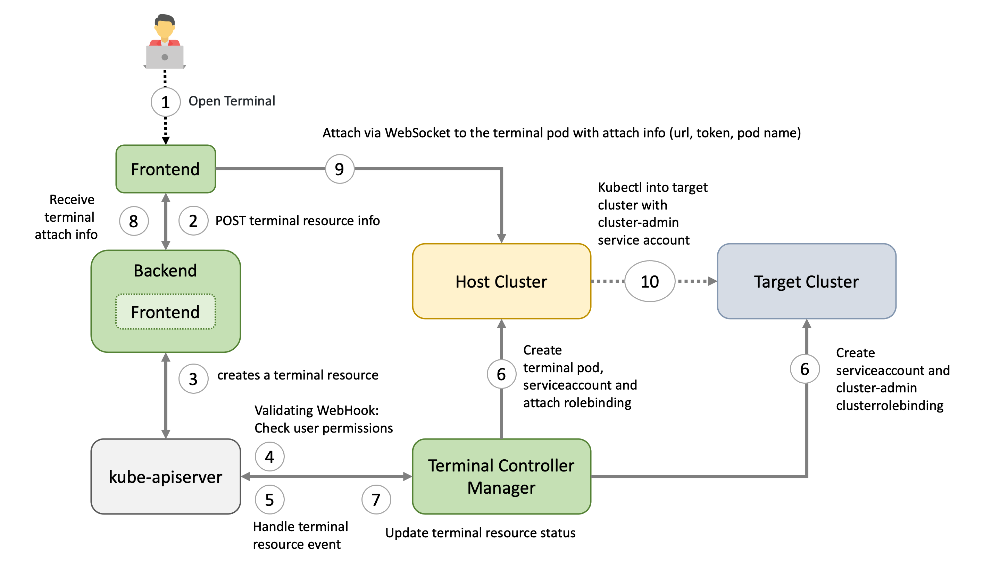

# Webterminals


## Architecture Overview


## Motivation
We want to give garden operators and "regular" users of the Gardener dashboard an easy way to have a preconfigured shell directly in the browser.

This has several advantages:
- no need to set up any tools locally
- no need to download / store kubeconfigs locally
- Each terminal session will have its own "access" service account created. This makes it easier to see "who" did "what" when using the web terminals.
- The "access" service account is deleted when the terminal session expires
- Easy "privileged" access to a node (privileged container, hostPID, and hostNetwork enabled, mounted host root fs) in case of troubleshooting node. If allowed by PSP.

## How it's done - TL;DR
On the host cluster, we schedule a pod to which the dashboard frontend client attaches to (similar to `kubectl attach`). Usually the [`ops-toolbelt`](https://github.com/gardener/ops-toolbelt/) image is used, containing all relevant tools like `kubectl`. The Pod has a kubeconfig secret mounted with the necessary privileges for the target cluster - usually `cluster-admin`.

## Target types
There are currently three targets, where a user can open a terminal session to:
- The (virtual) garden cluster - Currently operator only
- The shoot cluster
- The control plane of the shoot cluster - operator only

## Host
There are different factors on where the host cluster (and namespace) is chosen by the dashboard:
- Depending on, the selected target and the role of the user (operator or "regular" user) the host is chosen.
- For performance / low latency reasons, we want to place the "terminal" pods as near as possible to the target kube-apiserver.

For example, the user wants to have a terminal for a shoot cluster. The kube-apiserver of the shoot is running in the seed-shoot-ns on the seed.
- If the user is an operator, we place the "terminal" pod directly in the seed-shoot-ns on the seed.
- However, if the user is a "regular" user, we don’t want to have "untrusted" workload scheduled on the seeds, that's why the "terminal" pod is scheduled on the shoot itself, in a temporary namespace that is deleted afterwards.

## Lifecycle of a Web Terminal Session

### 1. Browser / Dashboard Frontend - Open Terminal
User chooses the target and clicks in the browser on `Open terminal` button. A POST request is made to the dashboard backend to request a new terminal session.

### 2. Dashboard Backend - Create Terminal Resource
According to the privileges of the user (operator / enduser) and the selected target, the dashboard backend creates a `terminal` resource **on behalf of the user** in the (virtual) garden and responds with a handle to the terminal session.

### 3. Browser / Dashboard Frontend
The frontend makes another POST request to the dashboard backend to fetch the terminal session. The Backend waits until the `terminal` resource is in a "ready" state (timeout 10s) before sending a response to the frontend. More to that later.

### 4. Terminal Resource
The `terminal` resource, among other things, holds the information of the desired host and target cluster. The credentials to these clusters are declared as references (secretRef / serviceAccountRef). The `terminal` resource itself doesn’t contain sensitive information.

### 5. Admission
A validating webhook is in place to ensure that the user, that created the `terminal` resource, has the **permission to read the referenced credentials**. There is also a mutating webhook in place. Both admission configurations have **`failurePolicy: Fail`**.

### 6. Terminal-Controller-Manager - Apply Resources on Host & Target Cluster
*Sidenote: The terminal-controller-manager has no knowledge about the gardener, its shoots, and seeds. In that sense it can be considered as independent from the gardener.*

The [terminal-controller-manager](https://github.com/gardener/terminal-controller-manager) watches `terminal` resources and ensures the desired state on the host and target cluster. The terminal-controller-manager needs the permission to read all secrets / service accounts in the virtual garden.
As additional safety net, the **terminal-controller-manager** ensures that the `terminal` resource was not created before the admission configurations were created.

The terminal-controller-manager then creates the necessary resources in the host and target cluster.
- Target Cluster:
  - "Access" service account + (cluster)rolebinding usually to `cluster-admin` cluster role
    - used from within the "terminal" pod
- Host Cluster:
  - "Attach" service Account + rolebinding to "attach" cluster role (privilege to attach and get pod)
    - will be used by the browser to attach to the pod
  - Kubeconfig secret, containing the "access" token from the target cluster
  - The "terminal" pod itself, having the kubeconfig secret mounted


### 7. Dashboard Backend - Responds to Frontend
As mentioned in step 3, the dashboard backend waits until the `terminal` resource is "ready". It then reads the "attach" token from the host cluster **on behalf of the user**.
It responds with:
  - attach token
  - hostname of the host cluster's api server
  - name of the pod and namespace

### 8. Browser / Dashboard Frontend - Attach to Pod
Dashboard frontend attaches to the pod located on the host cluster by opening a WebSocket connection using the provided parameter and credentials.
As long as the terminal window is open, the dashboard regularly annotates the `terminal` resource (heartbeat) to keep it alive.

### 9. Terminal-Controller-Manager - Cleanup
When there is no heartbeat on the `terminal` resource for a certain amount of time (default is `5m`) the created resources in the host and target cluster are cleaned up again and the `terminal` resource will be deleted.

## Browser Trusted Certificates for Kube-Apiservers

When the dashboard frontend opens a secure WebSocket connection to the kube-apiserver, the certificate presented by the kube-apiserver must be browser trusted. Otherwise, the connection can't be established due to browser policy. Most kube-apiservers have self-signed certificates from a custom Root CA.

The Gardener project now handles the responsibility of exposing the kube-apiservers with browser trusted certificates for `Seed`s (gardener/gardener#7764) and `Shoot`s (gardener/gardener#7712). For this to work, a `Secret` must exist in the `garden` namespace of the `Seed` cluster. This `Secret` should have a label `gardener.cloud/role=controlplane-cert`. The Secret is expected to contain the wildcard certificate for `Seed`s ingress domain.

## Allowlist for Hosts

### Motivation
When a user starts a terminal session, the dashboard frontend establishes a secure WebSocket connection to the corresponding kube-apiserver. This connection is controlled by the `connectSrc` directive of the content security policy, which governs the hosts that the browser can connect to.

By default, the `connectSrc` directive only permits connections to the same host. However, to enable the webterminal feature to function properly, connections to additional trusted hosts are required. This is where the `allowedHostSourceList` configuration becomes relevant. It directly impacts the `connectSrc` directive by specifying the hostnames that the browser is allowed to connect to during a terminal session. By defining this list, you can extend the range of terminal connections to include the necessary trusted hosts, while still preventing any unauthorized or potentially harmful connections.

### Configuration
The `allowedHostSourceList` can be configured within the `global.terminal` section of the `gardener-dashboard` Helm `values.yaml` file. The list should consist of permitted hostnames (without the scheme) for terminal connections.

It is important to consider that the usage of wildcards follows the rules defined by the content security policy.

Here is an example of how to configure the `allowedHostSourceList`:

```yaml
global:
  terminal:
    allowedHostSourceList:
    - "*.seed.example.com"
```

In this example, any host under the seed.example.com domain is allowed for terminal connections.
