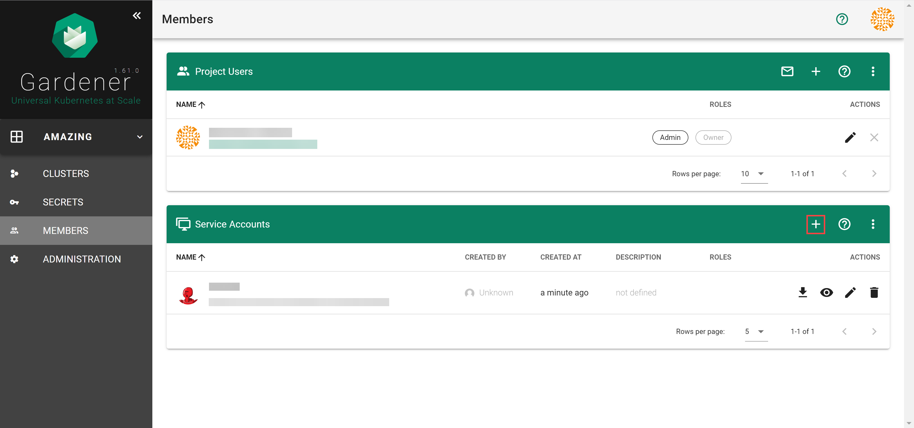
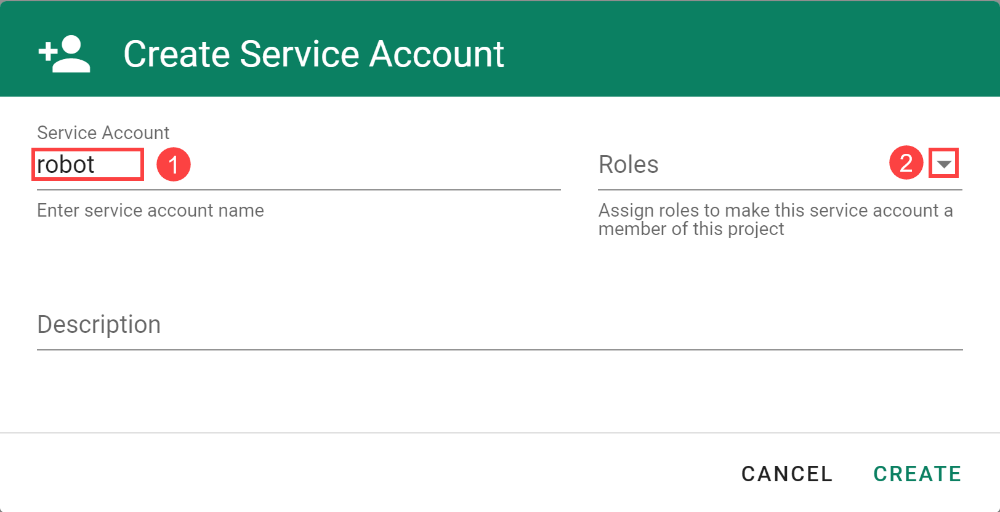
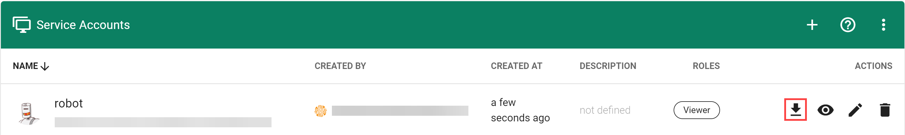
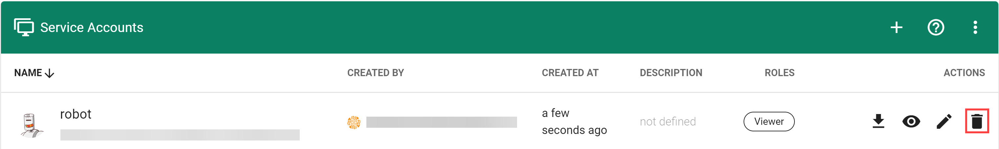

## Overview

The project resource operations that are performed manually in the dashboard or via `kubectl` can be automated using the [**Gardener API**](https://github.com/gardener/gardener/blob/master/docs/api-reference/README.md) and a **Service Account** authorized to perform them.

## Create a Service Account

### Prerequisites

- You are logged on to the Gardener Dashboard
- You have [created a project](working-with-projects.md)

### Steps

1. Select your project and choose *MEMBERS* from the menu on the left.

1. Locate the section *Service Accounts* and choose *+*.

   

1. Enter the service account details.

   

   The following *Roles* are available:

| Role | Granted Permissions |
|:---|:---|
| *Owner* | Combines the *Admin*, *UAM* and *Service Account Manager* roles. There can only be one owner per project. You can change the owner on the project administration page. |
| *Admin* | Allows to manage resources inside the project (e.g. secrets, shoots, configmaps and similar) and to manage permissions for service accounts. Note that the *Admin* role has read-only access to service accounts. |
| *Viewer* | Provides read access to project details and shoots. Has access to shoots but is not able to create new ones. Cannot read cloud provider secrets. |
| *UAM* | Allows to add/modify/remove human users, service accounts or groups to/from the project member list. In case an external UAM system is connected via a service account, only this account should get the *UAM* role. |
| *[Service Account Manager](https://github.com/gardener/gardener/blob/master/docs/usage/project/service-account-manager.md)* | Allows to manage service accounts inside the project namespace and request tokens for them. The permissions of the created service accounts are instead managed by the *Admin* role. For security reasons this role should not be assigned to service accounts. In particular it should be ensured that the service account is not able to refresh service account tokens forever. |

1. Choose *CREATE*.

## Use the Service Account

To use the service account, download or copy its `kubeconfig`. With it you can connect to the API endpoint of your Gardener project.

> Note: The downloaded `kubeconfig` contains the service account credentials. Treat with care.

## Delete the Service Account

Choose *Delete Service Account* to delete it.

## Related Links

- [Service Account Manager](https://github.com/gardener/gardener/blob/master/docs/usage/service-account-manager.md)
