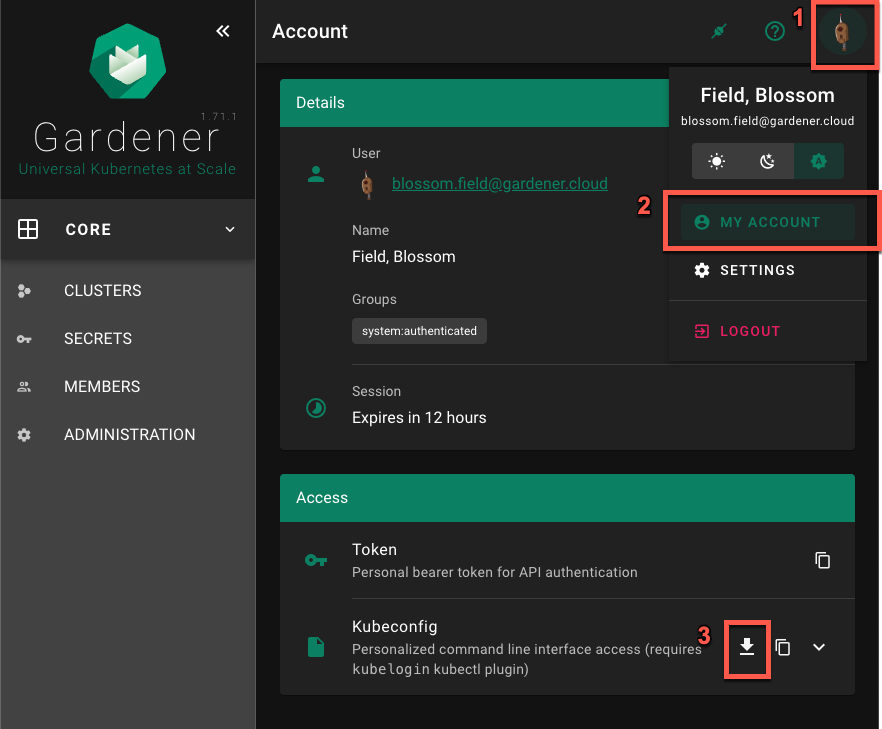
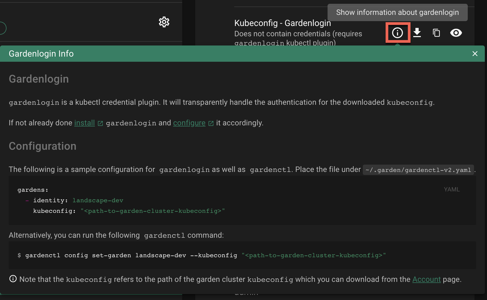
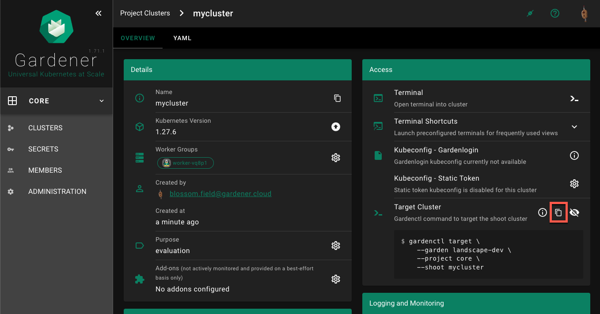
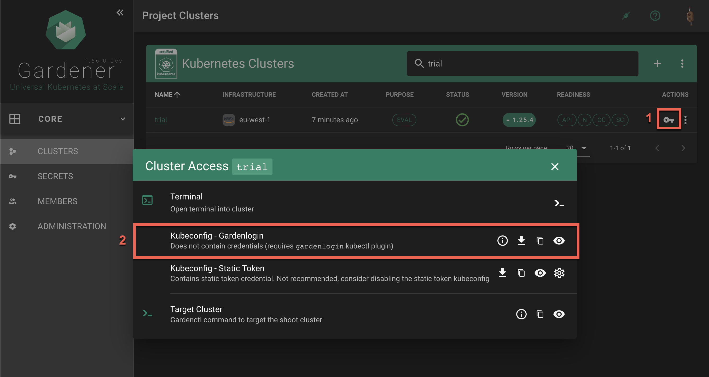
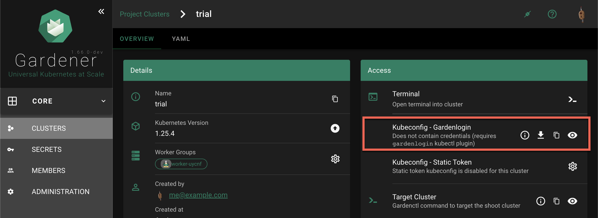
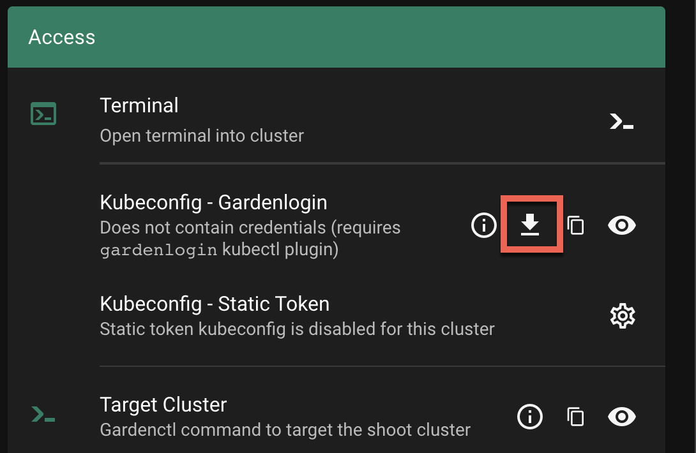

# Connect Kubectl

In Kubernetes, the configuration for accessing your cluster is in a format known as `kubeconfig`, which is stored as a file. It contains details such as cluster API server addresses and access credentials or a command to obtain access credentials from a `kubectl` credential plugin. In general, treat a `kubeconfig` as sensitive data. Tools like `kubectl` use the `kubeconfig` to connect and authenticate to a cluster and perform operations on it.
Learn more about [kubeconfig](https://kubernetes.io/docs/concepts/configuration/organize-cluster-access-kubeconfig/) and [kubectl](https://kubernetes.io/docs/reference/kubectl/) on [kubernetes.io](https://kubernetes.io).

## Tools

In this guide, we reference the following tools:
- [kubectl](https://kubernetes.io/docs/reference/kubectl/): Command-line tool for running commands against Kubernetes clusters. It allows you to control various aspects of your cluster, such as creating or modifying resources, viewing resource status, and debugging your applications.
- [kubelogin](https://github.com/int128/kubelogin): `kubectl` credential plugin used for OIDC authentication, which is required for the (OIDC) `Garden` cluster kubeconfig
- [gardenlogin](https://github.com/gardener/gardenlogin): `kubectl` credential plugin used for `Shoot` authentication as `system:masters`, which is required for the (`gardenlogin`) `Shoot` cluster kubeconfig
- [gardenctl](https://github.com/gardener/gardenctl-v2): Optional. Command-line tool to administrate one or many `Garden`, `Seed` and `Shoot` clusters. Use this tool to setup `gardenlogin` and `gardenctl` itself, configure access to clusters and configure cloud provider CLI tools.

## Connect Kubectl to a Shoot Cluster

In order to connect to a `Shoot` cluster, you first have to [install](https://github.com/gardener/gardenlogin/blob/master/README.md#installation) and [setup](#setup-gardenlogin) `gardenlogin`.

You can obtain the kubeconfig for the `Shoot` cluster either by [downloading](#download-from-dashboard) it from the Gardener dashboard or by [copying](#copy-and-run-gardenctl-target-command) the `gardenctl target` command from the dashboard and executing it.

### Setup Gardenlogin

##### Prerequisites

- You are logged on to the Gardener dashboard.
- The dashboard admin has configured OIDC for the dashboard.
- You have installed [kubelogin](https://github.com/int128/kubelogin/blob/master/README.md#setup)
- You have installed [gardenlogin](https://github.com/gardener/gardenlogin/blob/master/README.md#installation)

To setup `gardenlogin`, you need to:
- [Download the kubeconfig for the `Garden` cluster](#download-kubeconfig-for-the-garden-cluster)
- [Configure gardenlogin](#configure-gardenlogin)

##### Download Kubeconfig for the `Garden` Cluster

1. Navigate to the `MY ACCOUNT` page on the dashboard by clicking on the user avatar -> `MY ACCOUNT`.
2. Under the `Access` section, download the kubeconfig.


##### Configure Gardenlogin

Configure gardenlogin by following the installation instruction on the dashboard:
1. Select your project from the dropdown on the left
2. Choose `CLUSTERS` and select your cluster in the list.
3. Choose the `Show information about gardenlogin` info icon and follow the configuration hints.

> [!IMPORTANT]
> Use the [previously downloaded](#download-kubeconfig-for-the-garden-cluster) kubeconfig for the `Garden` cluster as the kubeconfig path. Do not use the `gardenlogin` `Shoot` cluster kubeconfig here.



### Download and Setup Kubeconfig for a `Shoot` Cluster

The `gardenlogin` kubeconfig for the `Shoot` cluster can be obtained in various ways:
- [Copy and run](#copy-and-run-gardenctl-target-command) the `gardenctl target` command from the dashboard
- [Download](#download-from-dashboard) from the Gardener dashboard

#### Copy and Run `gardenctl target` Command
Using the `gardenctl target` command you can quickly set or switch between clusters. The command sets the scope for the next operation, e.g., it ensures that the `KUBECONFIG` env variable always points to the current targeted cluster.

To target a `Shoot` cluster:

1. Copy the `gardenctl target` command from the dashboard

    
2. Paste and run the command in the terminal application, for example:
```bash
$ gardenctl target --garden landscape-dev --project core --shoot mycluster
Successfully targeted shoot "mycluster"
```

Your `KUBECONFIG` env variable is now pointing to the current target (also visible with `gardenctl target view -o yaml`). You can now run `kubectl` commands against your `Shoot` cluster.

```bash
$ kubectl get namespaces
```
The command connects to the cluster and list its namespaces.

##### KUBECONFIG Env Var not Setup Correctly

If your `KUBECONFIG` env variable does not point to the current target, you will see the following message after running the `gardenctl target` command:
```bash
WARN The KUBECONFIG environment variable does not point to the current target of gardenctl. Run `gardenctl kubectl-env --help` on how to configure the KUBECONFIG environment variable accordingly
```
In this case you would need to run the following command (assuming `bash` as your current shell). For other shells, consult the [gardenctl kubectl-env --help](https://github.com/gardener/gardenctl-v2/blob/master/docs/help/gardenctl_kubectl-env.md) documentation.
```bash
$ eval "$(gardenctl kubectl-env bash)"
```

#### Download from Dashboard

1. Select your project from the dropdown on the left, then choose `CLUSTERS` and locate your cluster in the list. Choose the *key* icon to bring up a dialog with the access options.

    

    In the `Kubeconfig - Gardenlogin` section the options are to *show gardenlogin info*, *download*, *copy* or *view* the `kubeconfig` for the cluster.

    The same options are available also in the `Access` section in the cluster details screen. To find it, choose a cluster from the list.

    
2. Choose the download icon to download the `kubeconfig` as file on your local system.

    

##### Connecting to the Cluster
In the following command, change `<path-to-gardenlogin-kubeconfig>` with the actual path to the file where you stored the `kubeconfig` downloaded in the previous step 2.
```bash
$ kubectl --kubeconfig=<path-to-gardenlogin-kubeconfig> get namespaces
```
The command connects to the cluster and list its namespaces.

##### Exporting KUBECONFIG environment variable
Since many `kubectl` commands will be used, it’s a good idea to take advantage of every opportunity to shorten the expressions. The `kubectl` tool has a fallback strategy for looking up a kubeconfig to work with. For example, it looks for the `KUBECONFIG` environment variable with value that is the path to the `kubeconfig` file meant to be used. Export the variable:
```bash
$ export KUBECONFIG=<path-to-gardenlogin-kubeconfig>
```
Again, replace `<path-to-gardenlogin-kubeconfig>` with the actual path to the kubeconfig for the cluster you want to connect to.

<br>

<br>

## What's next?
- [Using Dashboard Terminal](using-terminal.md)
