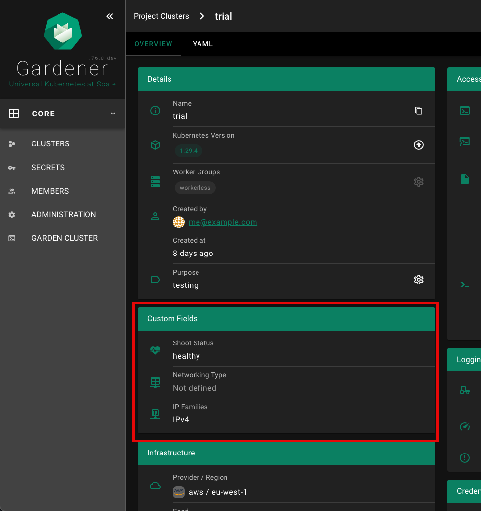
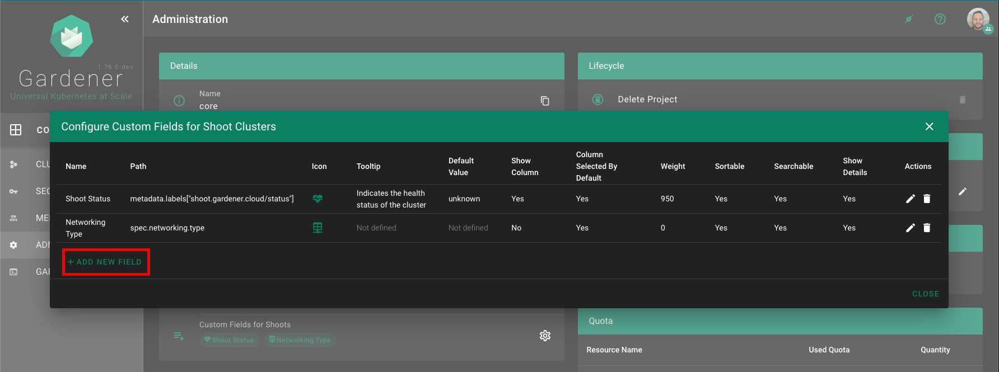
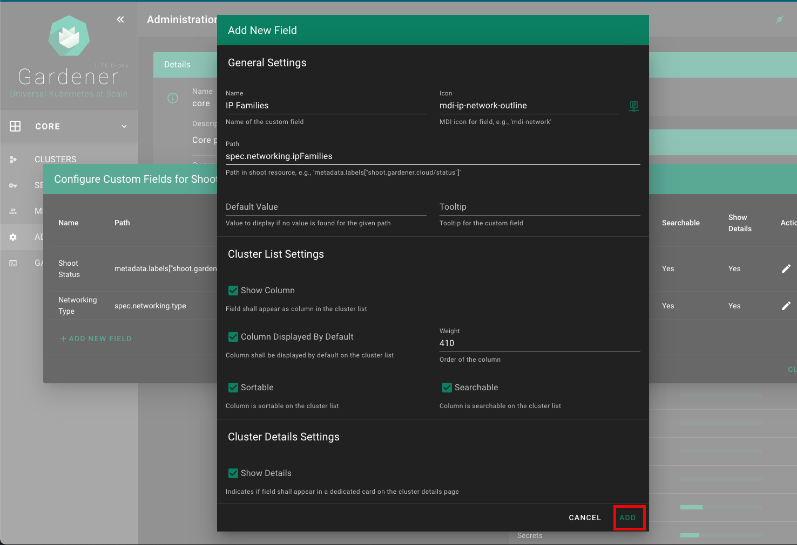

# Custom Shoot Fields

The Dashboard supports custom shoot fields, which can be configured to be displayed on the cluster list and cluster details page. Custom fields do not show up on the `ALL_PROJECTS` page.

## Project administration page:
Each custom field configuration is shown with its own chip.


Click on the chip to show more details for the custom field configuration.


Custom fields can be shown on the cluster list, if `showColumn` is enabled. See [configuration](#configuration) below for more details. In this example, a custom field for the Shoot status was configured.


Custom fields can be shown in a dedicated card (`Custom Fields`) on the cluster details page, if `showDetails` is enabled. See [configuration](#configuration) below for more details.



## Configuration

| Property | Type | Default | Required | Description |
|---|---|---|---|---|
| name | String | | ✔️ | Name of the custom field |
| path | String | | ✔️ | Path in shoot resource, of which the value must be of primitive type (no object / array). Use [lodash get](https://lodash.com/docs/4.17.15#get) path syntax, e.g. `metadata.labels["shoot.gardener.cloud/status"]` or `spec.networking.type` |
| icon | String | | | MDI icon for field on the cluster details page. See https://materialdesignicons.com/ for available icons. Must be in the format: `mdi-<icon-name>`. |
| tooltip | String | | | Tooltip for the custom field that appears when hovering with the mouse over the value  |
| defaultValue | String/Number | | | Default value, in case there is no value for the given `path` |
| showColumn | Bool | true | | Field shall appear as column in the cluster list |
| columnSelectedByDefault | Bool | true | | Indicates if field shall be selected by default on the cluster list (not hidden by default) |
| weight | Number | 0 | | Defines the order of the column. The built-in columns start with a weight of 100, increasing by 100 (200, 300, etc.) |
| sortable | Bool | true | | Indicates if column is sortable on the cluster list |
| searchable | Bool | true | | Indicates if column is searchable on the cluster list |
| showDetails | Bool | true | | Indicates if field shall appear in a dedicated card (`Custom Fields`) on the cluster details page |

## Editor for Custom Shoot Fields

The Gardener Dashboard now includes an editor for custom shoot fields, allowing users to configure these fields directly from the dashboard without needing to use `kubectl`. This editor can be accessed from the project administration page.

### Accessing the Editor

1. Navigate to the project administration page.
2. Scroll down to the `Custom Fields for Shoots` section.
3. Click on the gear icon to open the configuration panel for custom fields.


### Adding a New Custom Field


1. In the `Configure Custom Fields for Shoot Clusters` panel, click on the `+ ADD NEW FIELD` button.



2. Fill in the details for the new custom field in the `Add New Field` form. Refer to the [Configuration](#configuration) section for detailed descriptions of each field.

3. Click the `ADD` button to save the new custom field.



### Example

Custom shoot fields can be defined per project by specifying `metadata.annotations["dashboard.gardener.cloud/shootCustomFields"]`. The following is an example project yaml:
```yaml
apiVersion: core.gardener.cloud/v1beta1
kind: Project
metadata:
  annotations:
    dashboard.gardener.cloud/shootCustomFields: |
      {
        "shootStatus": {
          "name": "Shoot Status",
          "path": "metadata.labels[\"shoot.gardener.cloud/status\"]",
          "icon": "mdi-heart-pulse",
          "tooltip": "Indicates the health status of the cluster",
          "defaultValue": "unknown",
          "showColumn": true,
          "columnSelectedByDefault": true,
          "weight": 950,
          "searchable": true,
          "sortable": true,
          "showDetails": true
        },
        "networking": {
          "name": "Networking Type",
          "path": "spec.networking.type",
          "icon": "mdi-table-network",
          "showColumn": false
        }
      }
```
