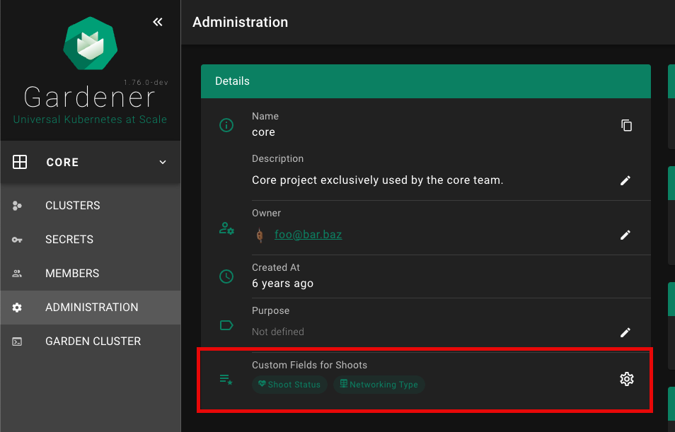
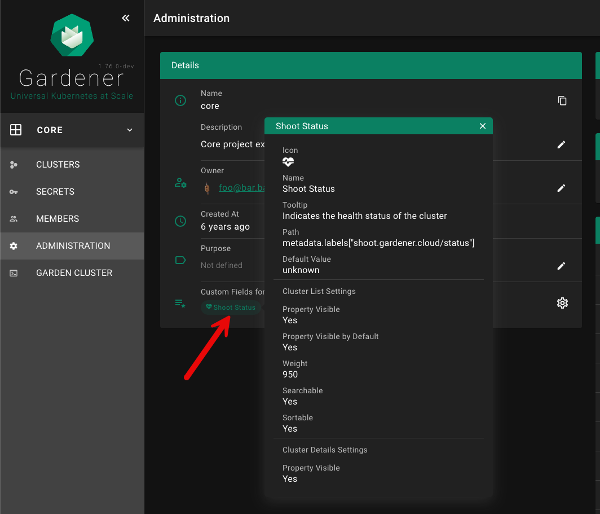
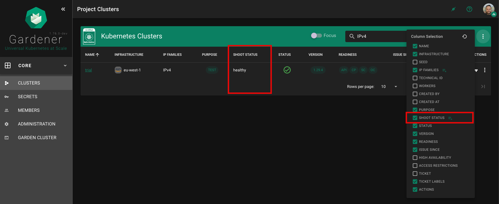

# Custom Shoot Fields

The Dashboard supports custom shoot fields, that can be defined per project by specifying `metadata.annotations["dashboard.gardener.cloud/shootCustomFields"]`.
The fields can be configured to be displayed on the cluster list and cluster details page.
Custom fields do not show up on the `ALL_PROJECTS` page.








| Property | Type | Default | Required | Description |
|---|---|---|---|---|
| name | String | | ✔️ | Name of the custom field |
| path | String | | ✔️ | Path in shoot resource, of which the value must be of primitive type (no object / array). Use [lodash get](https://lodash.com/docs/4.17.15#get) path syntax, e.g. `metadata.labels["shoot.gardener.cloud/status"]` or `spec.networking.type` |
| icon | String | | | MDI icon for field on the cluster details page. See https://materialdesignicons.com/ for available icons. Must be in the format: `mdi-<icon-name>`. |
| tooltip | String | | | Tooltip for the custom field that appears when hovering with the mouse over the value  |
| defaultValue | String/Number | | | Default value, in case there is no value for the given `path` |
| showColumn | Bool | true | | Field shall appear as column in the cluster list |
| columnSelectedByDefault | Bool | true | | Indicates if field shall be selected by default on the cluster list (not hidden by default) |
| weight | Number | 0 | | Defines the order of the column. The standard columns start with weight 100 and continue in 100 increments (200, 300, ..) |
| sortable | Bool | true | | Indicates if column is sortable on the cluster list.  |
| searchable | Bool | true | | Field shall appear in a dedicated card (`Custom Fields`) on the cluster details page |
| showDetails | Bool | true | | Indicates if field shall appear in a dedicated card (`Custom Fields`) on the cluster details page |

Example project yaml:
```yaml
apiVersion: core.gardener.cloud/v1beta1
kind: Project
metadata:
  annotations:
    dashboard.gardener.cloud/shootCustomFields: |
      {
        "shootStatus": {
          "name": "Shoot Status",
          "path": "metadata.labels[\"shoot.gardener.cloud/status\"]",
          "icon": "mdi-heart-pulse",
          "tooltip": "Indicates the health status of the cluster"
          "defaultValue": "unknown",
          "showColumn": true,
          "columnSelectedByDefault": true,
          "weight": 950,
          "searchable": true,
          "sortable": true,
          "showDetails": true
        },
        "networking": {
          "name": "Networking Type",
          "path": "spec.networking.type",
          "icon": "mdi-table-network",
          "showColumn": false
        }
      }
```
