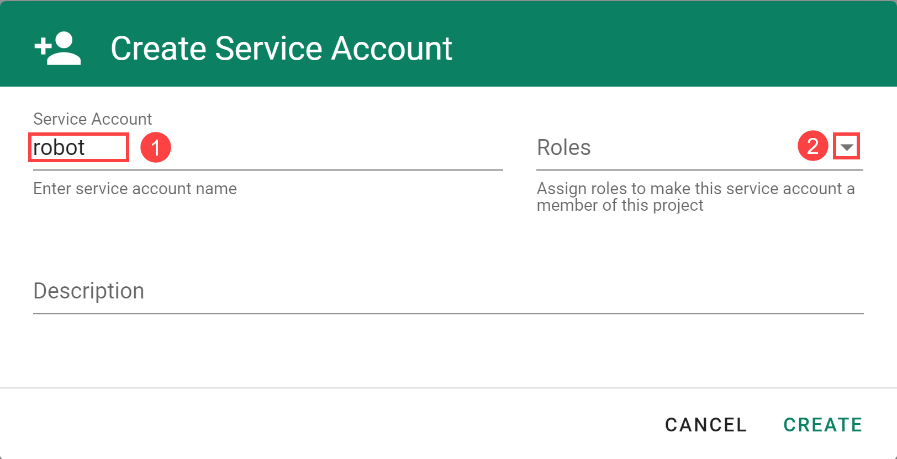
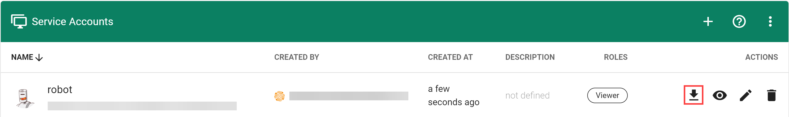
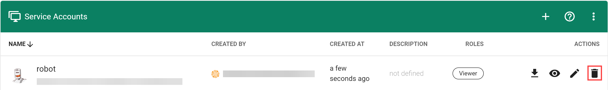

# Accessing the Gardener API Through the Dashboard

## Overview

The cluster operations that are performed manually in the dashboard or via `kubectl` can be automated using the [**Gardener API**](https://github.com/gardener/gardener/blob/master/docs/api-reference/README.md) and a **Service Account** authorized to perform them.

> Note: A project **Service Account** has access to all Kubernetes resources in the project. Treat with care.

## Create a Service Account

### Prerequisites

- You are logged on to the Gardener Dashboard
- You have [created a project](working-with-projects.md)

### Steps

1. Select your project and choose *MEMBERS* from the menu on the left.

2. Locate the section *Service Accounts* and choose *+*.

   

3. Enter the service account details.

   

   The following *Roles* are available:

   | Role | Granted Permissions |
   |:---|:---|
   | *Admin* | Fully manage resources inside the project, except for member management. Also the delete/modify permissions for `ServiceAccount`s are now deprecated for this role and will be removed in a future version of Gardener, use the `Service Account Manager` role instead. |
   | *Viewer* | Read all resources inside the project except secrets. |
   | *UAM* | Manage human users or groups in the project member list. Service accounts can only be managed admins. |
   | *[Service Account Manager](https://github.com/gardener/gardener/blob/master/docs/usage/service-account-manager.md)* | This allows to fully manage service accounts inside the project namespace and request tokens for them. For security reasons this role should not be assigned to service accounts, especially since a service account should not be able to refresh tokens for itself. |

4. Choose *CREATE*.

## Use the Service Account

To use the service account, download or copy its `kubeconfig`. With it you can connect to the API endpoint of your Gardener project.

## Delete the Service Account

Choose *Delete Service Account* to delete it.

## Related Links

- [Service Account Manager](https://github.com/gardener/gardener/blob/master/docs/usage/service-account-manager.md)