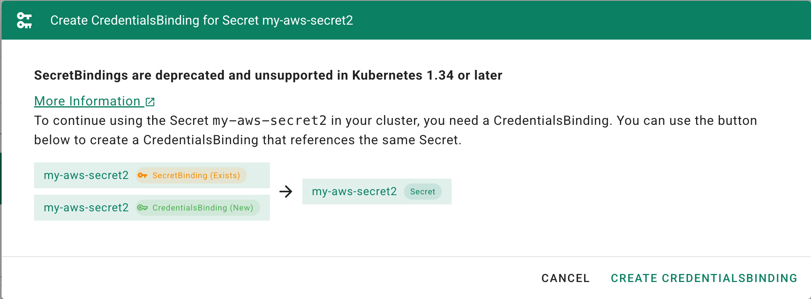
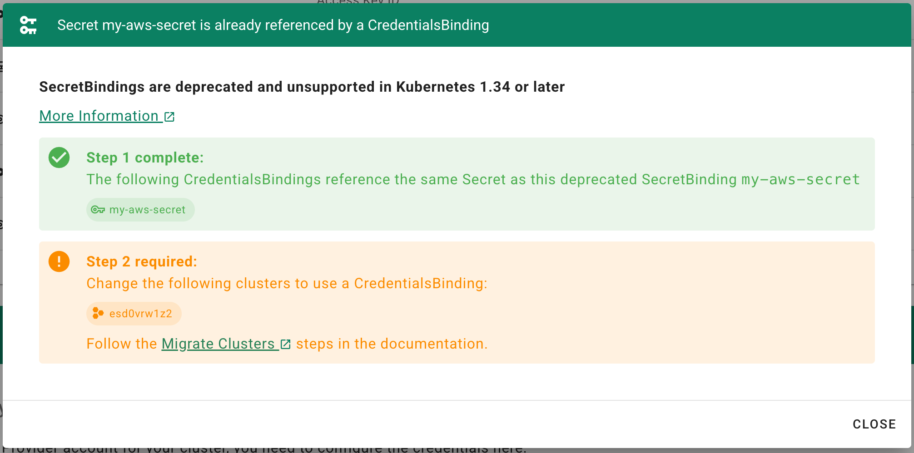
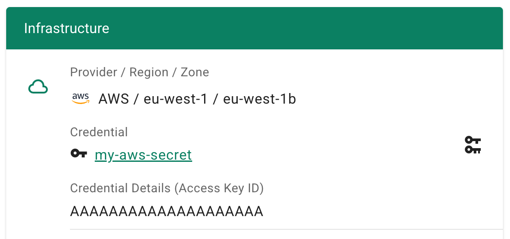
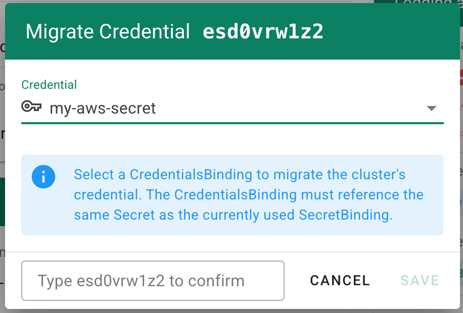

# Migrate SecretBindings to CredentialsBindings

With the introduction of the `CredentialsBinding` resource, a new way of referencing credentials in a Shoot was introduced.

`SecretBinding` resources are deprecated and are no longer supported for Shoots running **Kubernetes version 1.34 or higher**.

Follow [this](https://github.com/gardener/gardener/blob/master/docs/usage/shoot-operations/secretbinding-to-credentialsbinding-migration.md) link if you want to learn more about what the migration does.

* [Migrate SecretBindings to CredentialsBindings](#migrate-secretbindings-to-credentialsbindings)
  * [Background Information - How the Dashboard Handles Credentials](#background-information---how-the-dashboard-handles-credentials)
    * [DNS Credentials](#dns-credentials)
    * [Infrastructure Credentials](#infrastructure-credentials)
    * [Important Version Change](#important-version-change)
    * [How to Distinguish Binding Types](#how-to-distinguish-binding-types)
  * [Migration Steps](#migration-steps)
    * [Step 1: Create a `CredentialsBinding` for a `SecretBinding`](#step-1-create-a-credentialsbinding-for-a-secretbinding)
    * [Step 2: Migrate Clusters](#step-2-migrate-clusters)
    * [Step 3: Cleanup](#step-3-cleanup)

## Background Information - How the Dashboard Handles Credentials

On the **Credentials** page, you can view:

* **Infrastructure Credentials** (used by Shoots to schedule workloads)
* **DNS Credentials**

### DNS Credentials

DNS credentials are created either as:

* `Secret` resources, or
* `WorkloadIdentity` resources

They are directly visible in the Dashboard.

### Infrastructure Credentials

Infrastructure credentials are always created as a **pair**:

1. A `CredentialsBinding` resource
2. A referenced `Secret` or `WorkloadIdentity` resource

The `CredentialsBinding` is the resource that is referenced by the Shoot cluster.

The underlying `Secret` or `WorkloadIdentity`:

* Is created automatically
* Has the **same name** as the binding
* Is **not directly visible** in the Dashboard

### Important Version Change

* Historically, the Dashboard created `SecretBinding` resources.
* Starting with **Dashboard version 1.80.0**, the Dashboard always creates `CredentialsBinding` resources.
* Existing `SecretBinding` resources are still displayed and can still be used (for supported Kubernetes versions).

### How to Distinguish Binding Types

You can identify the binding type in the Dashboard:

* Hover over the icon next to the binding to see its type.
*  **Secret (SecretBinding)** → filled key icon
*  **Secret (CredentialsBinding)** → outlined key icon
*  **WorkloadIdentity credentials** → card symbol (always referenced by a CredentialsBinding)

## Migration Steps

The migration consists of three steps:

1. [Create a `CredentialsBinding` for each existing `SecretBinding`](#step-1-create-a-credentialsbinding-for-a-secretbinding).
2. [Update all Shoots that still reference a `SecretBinding` to use the new `CredentialsBinding`](#step-2-migrate-clusters).
3. [Delete old `SecretBinding` resources after all Shoots have been migrated](#step-3-cleanup).

### Step 1: Create a `CredentialsBinding` for a `SecretBinding`

On the **Credentials** page, SecretBindings now have an additional action button:

Clicking this button opens a dialog where you can create a new `CredentialsBinding` for the selected `SecretBinding`.

When clicking **CREATE CREDENTIALSBINDING**:

* The Dashboard creates a `CredentialsBinding`
* It uses the **same name** as the existing `SecretBinding`
* It references the same underlying `Secret`

After creation, the dialog shows the current migration status, including an overview of clusters that still need to be migrated.

### Step 2: Migrate Clusters

After creating `CredentialsBinding` resources for your `SecretBindings`, you must update your Shoots.

To migrate a Shoot:

1. Navigate to the **cluster details page**
2. Click the key-change icon button (**Migrate Credential**) next to the credential information
3. A dialog opens where you can select a `CredentialsBinding`

You can only select a `CredentialsBinding` that references the **same Secret** as the currently used `SecretBinding`.

> [!NOTE]
> If no suitable binding is shown, ensure that you completed [Step 1](#step-1-create-a-credentialsbinding-for-a-secretbinding) and created a `CredentialsBinding` for the corresponding `SecretBinding` on the **Credentials** page.

### Step 3: Cleanup

If a `SecretBinding` is no longer referenced by any Shoots because they were migrated to use a `CredentialsBinding`, it can be safely deleted.
