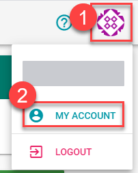
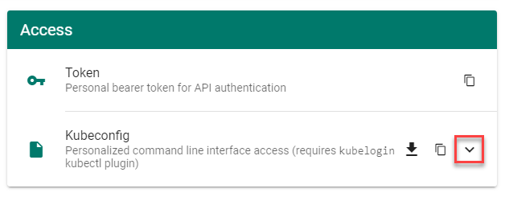

# Project Operations

This section demonstrates how to use the standard Kubernetes tool for cluster operation `kubectl` for common cluster operations with emphasis on Gardener resources. For more information on `kubectl`, see [kubectl](https://kubernetes.io/docs/reference/kubectl/overview/) on _kubernetes.io_.


- [Project Operations](#project-operations)
  - [Prerequisites](#prerequisites)
  - [Using `kubeconfig` for remote project operations](#using-kubeconfig-for-remote-project-operations)
    - [Downloading your `kubeconfig`](#downloading-your-kubeconfig)
  - [List Gardener API resources](#list-gardener-api-resources)
  - [Check your permissions](#check-your-permissions)
  - [Working with projects](#working-with-projects)
  - [Working with clusters](#working-with-clusters)
    - [List project clusters](#list-project-clusters)
    - [Create a new cluster](#create-a-new-cluster)
    - [Delete cluster](#delete-cluster)
    - [Get `kubeconfig` for a cluster](#get-kubeconfig-for-a-cluster)
  - [Related Links](#related-links)


## Prerequisites

- You’re logged on to the Gardener Dashboard.
- You’ve created a cluster and its status is operational.

It's recommended that you get acquainted with the resources in the [Gardener API](https://github.com/gardener/gardener/tree/master/docs/api-reference).


## Using `kubeconfig` for remote project operations

The `kubeconfig` for project operations is different from the one for cluster operations. It has a larger scope and allows a different set of operations that are applicable for a project administrator role, such as lifecycle control on clusters and managing project members.

Depending on your goal, you can create a service account suitable for automation and use it for your pipelines, or you can get a user-specific `kubeconfig` and use it to manage your project resources via kubectl.

### Downloading your `kubeconfig`

Kubernetes doesn’t offer an own resource type for human users that access the API server. Instead, you either have to manage unique user strings, or use an OpenID-Connect (OIDC) compatible Identity Provider (IDP) to do the job.

Once the latter is set up, each Gardener user can use the `kubelogin` plugin for `kubectl` to authenticate against the API server:

1. Set up `kubelogin` if you don't have it yet. More information: [kubelogin setup](https://github.com/int128/kubelogin#setup).

1. Open the menu at the top right of the screen, then choose **MY ACCOUNT**.

    

1. On the **Access** card, choose the arrow to see all options for the personalized command-line interface access.

    

    > The personal bearer token that is also offered here only provides access for a limited amount of time for one time operations, for example, in `curl` commands. The `kubeconfig` provided for the personalized access is used by `kubelogin` to grant access to the Gardener API for the user permanently by using a refresh token.

1. Check that the right **Project** is chosen and keep the settings otherwise. Download the `kubeconfig` file and add its path to the `KUBECONFIG` environment variable.

You can now execute `kubectl` commands on the garden cluster using the identity of your user.

> Note: You can also manage your Gardener project resources automatically using a Gardener service account. For more information, see [Automating Project Resource Management](./automated-resource-management.md).

## List Gardener API resources

1. Using a `kubeconfig` for project operations, you can  list the Gardner API resources using the following command:

    ```
    kubectl api-resources | grep garden
    ```

    The response looks like this:

    ```
    backupbuckets                     bbc             core.gardener.cloud            false        BackupBucket
    backupentries                     bec             core.gardener.cloud            true         BackupEntry
    cloudprofiles                     cprofile,cpfl   core.gardener.cloud            false        CloudProfile
    controllerinstallations           ctrlinst        core.gardener.cloud            false        ControllerInstallation
    controllerregistrations           ctrlreg         core.gardener.cloud            false        ControllerRegistration
    plants                            pl              core.gardener.cloud            true         Plant
    projects                                          core.gardener.cloud            false        Project
    quotas                            squota          core.gardener.cloud            true         Quota
    secretbindings                    sb              core.gardener.cloud            true         SecretBinding
    seeds                                             core.gardener.cloud            false        Seed
    shoots                                            core.gardener.cloud            true         Shoot
    shootstates                                       core.gardener.cloud            true         ShootState
    terminals                                         dashboard.gardener.cloud       true         Terminal
    clusteropenidconnectpresets       coidcps         settings.gardener.cloud        false        ClusterOpenIDConnectPreset
    openidconnectpresets              oidcps          settings.gardener.cloud        true         OpenIDConnectPreset
    ```

2. Enter the following command to view the Gardener API versions:

    ```
    kubectl api-versions | grep garden
    ```

    The response looks like this:

    ```
    core.gardener.cloud/v1alpha1
    core.gardener.cloud/v1beta1
    dashboard.gardener.cloud/v1alpha1
    settings.gardener.cloud/v1alpha1
    ```

## Check your permissions

1. The operations on project resources are limited by the role of the identity that tries to perform them. To get an overview over your permissions, use the following command:

    ```
    kubectl auth can-i --list | grep garden
    ```

    The response looks like this:

    ```
    plants.core.gardener.cloud                      []                       []                 [create delete deletecollection get list patch update watch]
    quotas.core.gardener.cloud                      []                       []                 [create delete deletecollection get list patch update watch]
    secretbindings.core.gardener.cloud              []                       []                 [create delete deletecollection get list patch update watch]
    shoots.core.gardener.cloud                      []                       []                 [create delete deletecollection get list patch update watch]
    terminals.dashboard.gardener.cloud              []                       []                 [create delete deletecollection get list patch update watch]
    openidconnectpresets.settings.gardener.cloud    []                       []                 [create delete deletecollection get list patch update watch]
    cloudprofiles.core.gardener.cloud               []                       []                 [get list watch]
    projects.core.gardener.cloud                    []                       [flowering]             [get patch update delete]
    namespaces                                      []                       [garden-flowering]      [get]
    ```

2. Try to execute an operation that you aren’t allowed, for example:

    ```
    kubectl get projects
    ```

    You receive an error message like this:

    ```
    Error from server (Forbidden): projects.core.gardener.cloud is forbidden: User "system:serviceaccount:garden-flowering:robot" cannot list resource "projects" in API group "core.gardener.cloud" at the cluster scope
    ```

## Working with projects

1. You can get the details for a project, where you (or the service account) is a member.

    ```
    kubectl get project flowering
    ```

    The response looks like this:

    ```
    NAME        NAMESPACE          STATUS   OWNER                    CREATOR                         AGE
    flowering   garden-flowering   Ready    [PROJECT-ADMIN]@domain   [PROJECT-ADMIN]@domain system   45m
    ```

    > For more information, see [Project](https://github.com/gardener/gardener/blob/master/docs/api-reference/core.md#project) in the API reference.

2. To query the names of the members of a project, use the following command:

    ```
    kubectl get project docu -o jsonpath='{.spec.members[*].name }'
    ```

    The response looks like this:

    ```
    [PROJECT-ADMIN]@domain system:serviceaccount:garden-flowering:robot
    ```

    > For more information, see [members](https://github.com/gardener/gardener/blob/master/docs/api-reference/core.md#projectmember) in the API reference.

## Working with clusters

The Gardener domain object for a managed cluster is called [Shoot](https://github.com/gardener/gardener/blob/master/docs/api-reference/core.md#shoot).

### List project clusters

To query the clusters in a project:
```
kubectl get shoots
```

The output looks like this:

```
NAME       CLOUDPROFILE   VERSION   SEED      DOMAIN                                 HIBERNATION   OPERATION   PROGRESS   APISERVER   CONTROL   NODES   SYSTEM   AGE
geranium   aws            1.18.3    aws-eu1   geranium.flowering.shoot.<truncated>   Awake         Succeeded   100        True        True      True    True     74m
```
### Create a new cluster

To create a new cluster using the command line, you need a YAML definition of the `Shoot` resource.

1. To get started, copy the following YAML definition to a new file, for example, `daffodil.yaml` (or copy file [shoot.yaml](shoot.yaml) to `daffodil.yaml`) and adapt it to your needs.

    ```
    apiVersion: core.gardener.cloud/v1beta1
    kind: Shoot
    metadata:
      name: daffodil
      namespace: garden-flowering
    spec:
      secretBindingName: trial-secretbinding-gcp
      cloudProfileName: gcp
      region: europe-west1
      purpose: evaluation
      provider:
        type: gcp
        infrastructureConfig:
          kind: InfrastructureConfig
          apiVersion: gcp.provider.extensions.gardener.cloud/v1alpha1
          networks:
            workers: 10.250.0.0/16
        controlPlaneConfig:
          apiVersion: gcp.provider.extensions.gardener.cloud/v1alpha1
          zone: europe-west1-c
          kind: ControlPlaneConfig
        workers:
        - name: cpu-worker
          maximum: 2
          minimum: 1
          maxSurge: 1
          maxUnavailable: 0
          machine:
            type: n1-standard-2
            image:
              name: coreos
              version: 2303.3.0
          volume:
            type: pd-standard
            size: 50Gi
          zones:
            - europe-west1-c
      networking:
        type: calico
        pods: 100.96.0.0/11
        nodes: 10.250.0.0/16
        services: 100.64.0.0/13
      maintenance:
        timeWindow:
          begin: 220000+0100
          end: 230000+0100
        autoUpdate:
          kubernetesVersion: true
          machineImageVersion: true
      hibernation:
        enabled: true
        schedules:
          - start: '00 17 * * 1,2,3,4,5'
            location: Europe/Kiev
      kubernetes:
        allowPrivilegedContainers: true
        kubeControllerManager:
          nodeCIDRMaskSize: 24
        kubeProxy:
          mode: IPTables
        version: 1.18.3
      addons:
        nginxIngress:
          enabled: false
        kubernetesDashboard:
          enabled: false

    ```

1. In your new YAML definition file, replace the value of field `metadata.namespace` with your namespace following the convention `garden-[YOUR-PROJECTNAME]`.

1. Create a cluster using this manifest (with flag `--wait=false` the command returns immediately, otherwise it doesn't return until the process is finished):

    ```
    kubectl apply -f daffodil.yaml --wait=false
    ```

    The response looks like this:
    ```
    shoot.core.gardener.cloud/daffodil created
    ```

1. It takes 5–10 minutes until the cluster is created. To watch the progress, get all shoots and use the `-w` flag.

    ```
    kubectl get shoots -w
    ```

For a more extended example, see [Gardener example shoot manifest](https://github.com/gardener/gardener/blob/master/example/90-shoot.yaml).

### Delete cluster

To delete a shoot cluster, you must first annotate the shoot resource to confirm the operation with `confirmation.gardener.cloud/deletion: "true"`:

1. Add the annotation to your manifest (`daffodil.yaml` in the previous example):

    ```
    apiVersion: core.gardener.cloud/v1beta1
      kind: Shoot
      metadata:
        name: daffodil
        namespace: garden-flowering
        annotations:
          confirmation.gardener.cloud/deletion: "true"
      spec:
        addons:
    ...
    ```

1. Apply your changes of `daffodil.yaml`.

    ```
    kubectl apply -f daffodil.yaml
    ```

    The response looks like this:

    ```
    shoot.core.gardener.cloud/daffodil configured
    ```

1. Trigger the deletion.

    ```
    kubectl delete shoot daffodil --wait=false
    ```

    The response looks like this:

    ```
    shoot.core.gardener.cloud "daffodil" deleted
    ```

1. It takes 5–10 minutes to delete the cluster. To watch the progress, get all shoots and use the `-w` flag.

    ```
    kubectl get shoots -w
    ```


### Get `kubeconfig` for a cluster

To get the kubeconfig for a cluster:

```
kubectl get secrets daffodil.kubeconfig -o jsonpath='{.data.kubeconfig}' | base64 -d
```

The response looks like this:

```
---
apiVersion: v1
kind: Config
current-context: shoot--flowering--daffodil
clusters:
- name: shoot--flowering--daffodil
  cluster:
    certificate-authority-data: LS0tLS1CRUdJTiBDR <truncated>
    server: https://api.daffodil.flowering.shoot.<truncated>
contexts:
- name: shoot--flowering--daffodil
  context:
    cluster: shoot--flowering--daffodil
    user: shoot--flowering--daffodil-token
users:
- name: shoot--flowering--daffodil-token
  user:
    token: HbjYIMuR9hmyb9 <truncated>

```
The name of the Secret containing the kubeconfig is in the form `<cluster-name>.kubeconfig`, that is, in this example: `daffodil.kubeconfig`

## Related Links

- [Automating Project Resource Management](./automated-resource-management.md)

- [Authenticating with an Identity Provider](https://github.com/gardener/documentation/blob/master/website/documentation/guides/administer-shoots/oidc-login/_index.md).
