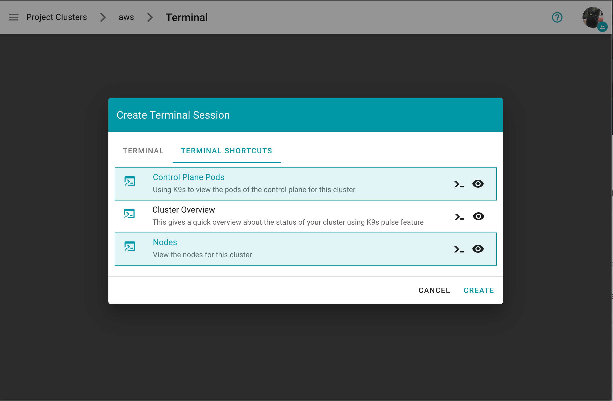

# Terminal Shortcuts

As user and/or gardener administrator you can configure terminal shortcuts, which are preconfigured terminals for frequently used views.

You can launch the terminal shortcuts directly on the shoot details screen.


You can view the definition of a terminal terminal shortcut by clicking on they eye icon


What also has improved is, that when creating a new terminal you can directly alter the configuration.


With expanded configuration


On the `Create Terminal Session` dialog you can choose one or multiple terminal shortcuts.


Project specific terminal shortcuts created (by a member of the project) have a project icon badge and are listed as `Unverified`.


A warning message is displayed before a project specific terminal shortcut is ran informing the user about the risks.


**How to create a project specific terminal shortcut**

_Disclaimer:_ "Project specific terminal shortcuts" is experimental feature and may change in future releases (we plan to introduce a dedicated custom resource).

You need to create a secret with the name `terminal.shortcuts` within your project namespace, containing your terminal shortcut configurations. Under `data.shortcuts` you add a list of terminal shortcuts (base64 encoded).
Example `terminal.shortcuts` secret:
```yaml
kind: Secret
type: Opaque
metadata:
  name: terminal.shortcuts
  namespace: garden-myproject
apiVersion: v1
data:
  shortcuts: LS0tCi0gdGl0bGU6IE5ldHdvcmtEZWxheVRlc3RzCiAgZGVzY3JpcHRpb246IFNob3cgbmV0d29ya21hY2hpbmVyeS5pbydzIE5ldHdvcmtEZWxheVRlc3RzCiAgdGFyZ2V0OiBzaG9vdAogIGNvbnRhaW5lcjoKICAgIGltYWdlOiBxdWF5LmlvL2RlcmFpbGVkL2s5czpsYXRlc3QKICAgIGFyZ3M6CiAgICAtIC0taGVhZGxlc3MKICAgIC0gLS1jb21tYW5kPW5ldHdvcmtkZWxheXRlc3QKICBzaG9vdFNlbGVjdG9yOgogICAgbWF0Y2hMYWJlbHM6CiAgICAgIGZvbzogYmFyCi0gdGl0bGU6IFNjYW4gQ2x1c3RlcgogIGRlc2NyaXB0aW9uOiBTY2FucyBsaXZlIEt1YmVybmV0ZXMgY2x1c3RlciBhbmQgcmVwb3J0cyBwb3RlbnRpYWwgaXNzdWVzIHdpdGggZGVwbG95ZWQgcmVzb3VyY2VzIGFuZCBjb25maWd1cmF0aW9ucwogIHRhcmdldDogc2hvb3QKICBjb250YWluZXI6CiAgICBpbWFnZTogcXVheS5pby9kZXJhaWxlZC9rOXM6bGF0ZXN0CiAgICBhcmdzOgogICAgLSAtLWhlYWRsZXNzCiAgICAtIC0tY29tbWFuZD1wb3BleWU=
```

**How to configure the dashboard with terminal shortcuts**
Example `values.yaml`:
```yaml
frontend:
  features:
    terminalEnabled: true
    projectTerminalShortcutsEnabled: true # members can create a `terminal.shortcuts` secret containing the project specific terminal shortcuts
  terminal:
    shortcuts:
    - title: "Control Plane Pods"
      description: Using K9s to view the pods of the control plane for this cluster
      target: cp
      container:
        image: quay.io/derailed/k9s:latest
        - "--headless"
        - "--command=pods"
    - title: "Cluster Overview"
      description: This gives a quick overview about the status of your cluster using K9s pulse feature
      target: shoot
      container:
        image: quay.io/derailed/k9s:latest
        args:
        - "--headless"
        - "--command=pulses"
    - title: "Nodes"
      description: View the nodes for this cluster
      target: shoot
      container:
        image: quay.io/derailed/k9s:latest
        command:
        - bin/sh
        args:
        - -c
        - sleep 1 && while true; do k9s --headless --command=nodes; done
#      shootSelector:
#        matchLabels:
#          foo: bar
[...]
terminal: # is generally required for the terminal feature
  container:
    image: eu.gcr.io/gardener-project/gardener/ops-toolbelt:0.10.0
  containerImageDescriptions:
    - image: /.*/ops-toolbelt:.*/
      description: Run `ghelp` to get information about installed tools and packages
  gardenTerminalHost:
    seedRef: my-soil
  garden:
    operatorCredentials:
      serviceAccountRef:
        name: dashboard-terminal-admin
        namespace: garden
```
