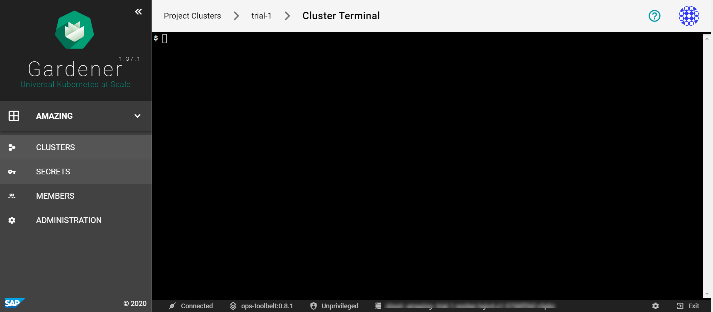

# Using the Dashboard Terminal

The dashboard features an integrated web-based terminal to your clusters. It allows you to use `kubectl` without the need to supply `kubeconfig`. There are several ways to access it and they're described on this page.

### Prerequisites
- You are logged on to the Gardener Dashboard.
- You have created a cluster and its status is operational.
- The landscape administrator has enabled the terminal feature
- The cluster you want to connect to is reachable from the dashboard

On this page:
- [Open from cluster list](#open-from-cluster-list)
- [Open from cluster details page](#open-from-cluster-details-page)
- [Terminal](#terminal)

<br>

### Open from cluster list
1. Choose your project from the menu on the left and choose CLUSTERS.
2. Locate a cluster for which you want to open a Terminal and choose the *key* icon.
3. In the dialog, choose the icon on the right of the Terminal label.

    

### Open from cluster details page
1. Choose your project from the menu on the left and choose CLUSTERS.
2. Locate a cluster for which you want to open a Terminal and choose to display its details.
3. In the Access section, choose the icon on the right of the Terminal label.

    

### Terminal
Opening up the terminal in either of the ways discussed here results in the following screen:



It provides a `bash` environment and range of useful tools and an installed and configured `kubectl` (with alias `k`) to use right away with your cluster.

Try to list the namespaces in the cluster.
```
$ k get ns
```
You get a result like this:

