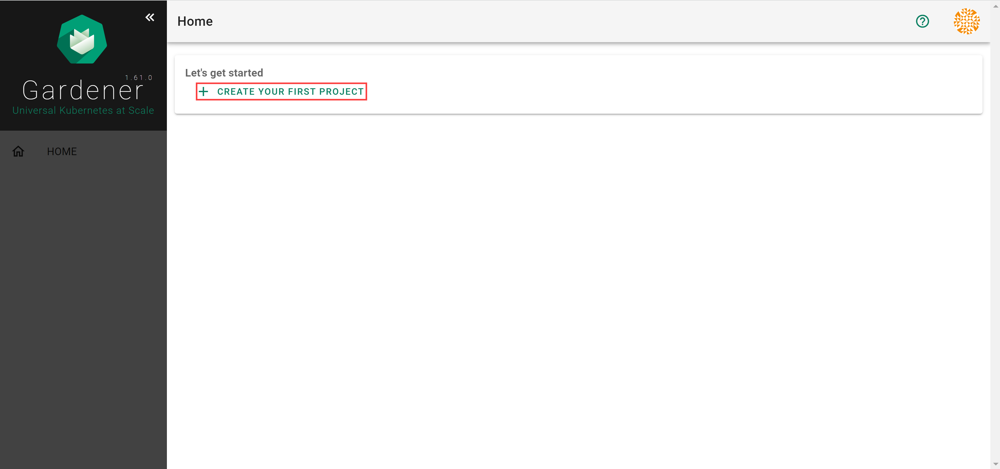
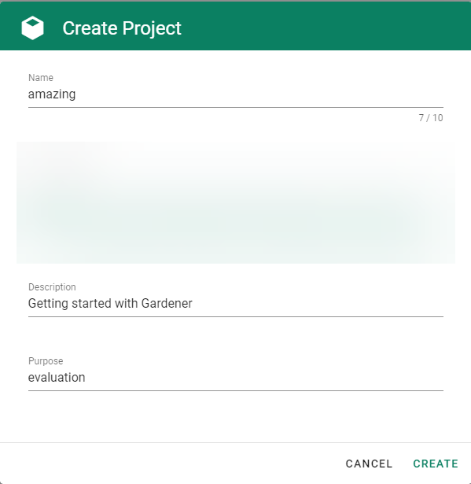
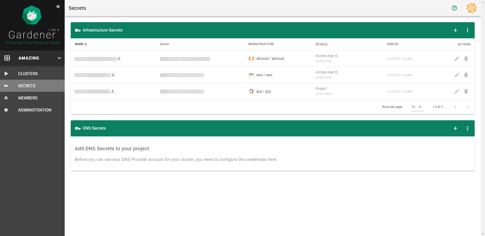
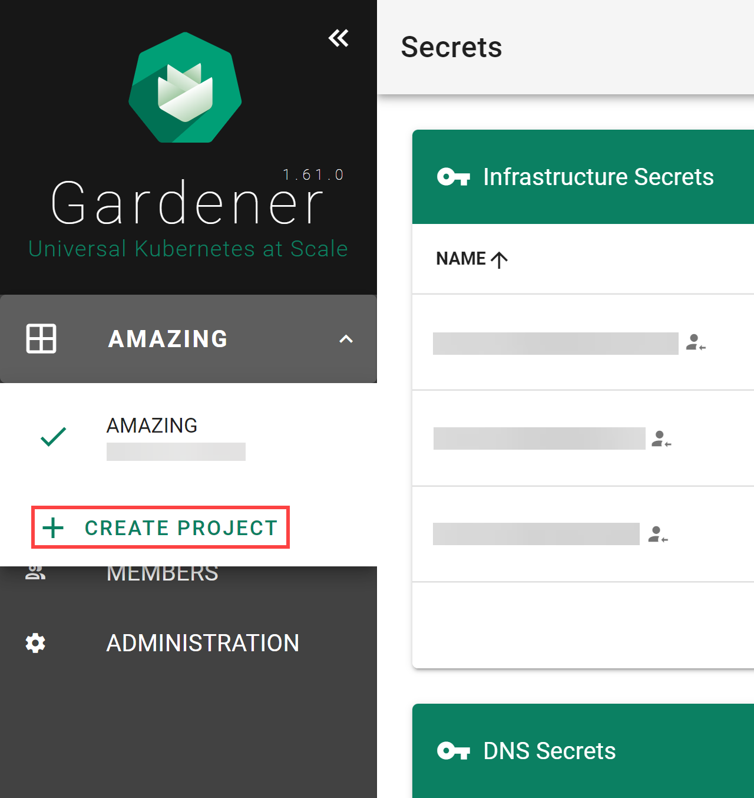
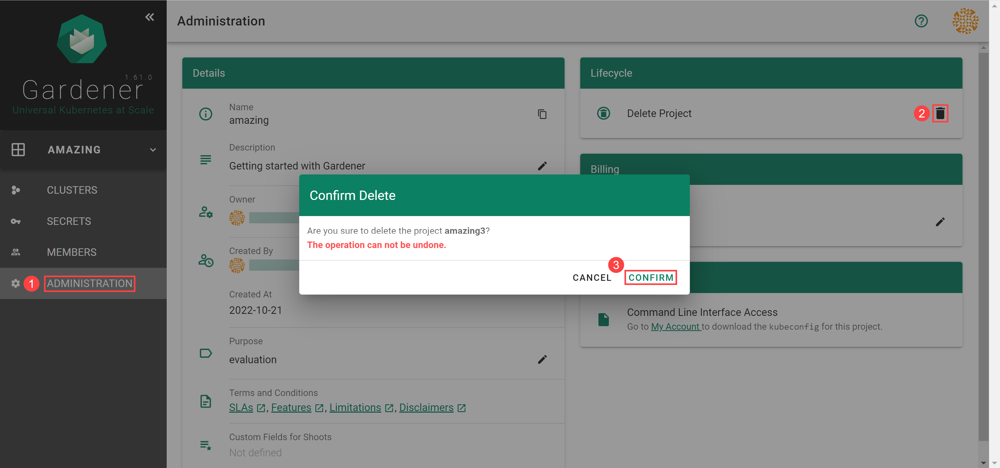

# Working with Projects

## Overview

Projects are used to group clusters, onboard IaaS resources utilized by them, and organize access control.
To work with clusters, first you need to create a project that they will belong to.

## Creating Your First Project

### Prerequisites
- You have access to the Gardener Dashboard and have permissions to create projects

### Steps

1. Logon to the Gardener Dashboard and choose **CREATE YOUR FIRST PROJECT**.
  
    

2. Provide a project **Name**, and optionally a **Description** and a **Purpose**, and choose **CREATE**.

    

  > :warning: You will **not** be able to change the project name later. The rest of the details will be editable.

### Result

After completing the steps above, you will arrive at a similar screen:
  

## Creating More Projects

If you need to create more projects, expand the `Projects` list dropdown on the left. When expanded, it reveals a **CREATE PROJECT** button that brings up the same dialog as above.

## Rotating Your Project's Secrets

After rotating your Gardener credentials and updating the corresponding secret in Gardener, you also need to reconcile all the shoots so that they can start using the updated secret. Updating the secret on its own won't trigger shoot reconciliation and the shoot will use the old credentials until reconciliation, which is why you need to either trigger reconciliation or wait until it is performed in the next maintenance time window.

For more information, see [Credentials Rotation for Shoot Clusters](https://github.com/gardener/gardener/blob/master/docs/usage/shoot-operations/shoot_credentials_rotation.md#cloud-provider-keys).

## Deleting Your Project

When you need to delete your project, go to **ADMINISTRATON**, choose the trash bin icon and, confirm the operation.

