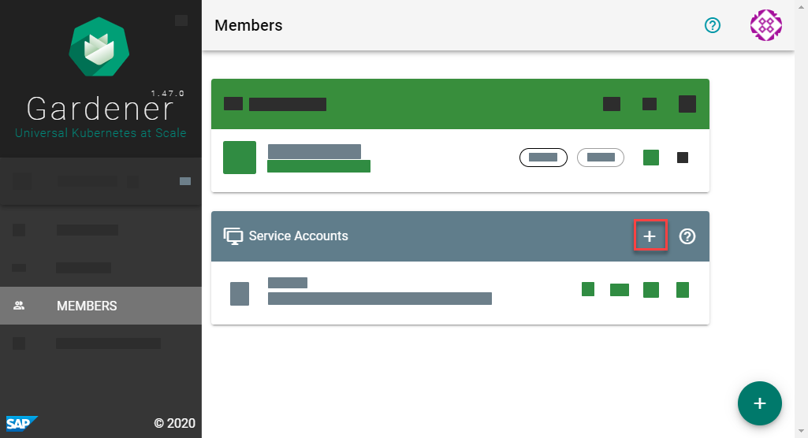
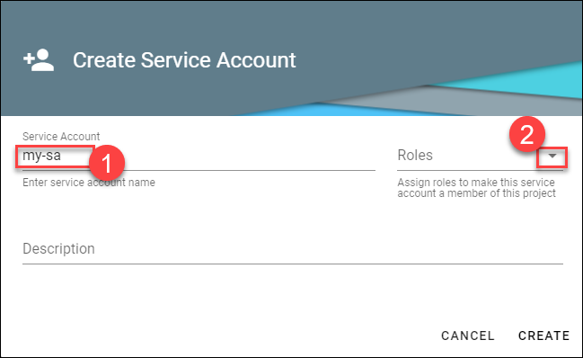
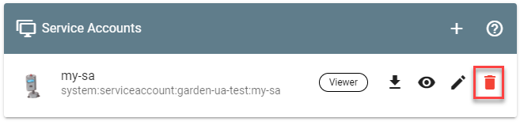

# Working with Service Accounts

## Prerequisites

- You are logged on to the Gardener Dashboard
- You have [created a project](working-with-projects.md).

The cluster operations that are performed manually in the dashboard or via `kubectl` can be automated using the [Gardener API](https://github.com/gardener/gardener/tree/master/docs/api-reference). You need a **service account** to be authorized to perform them.

> The service account of a project has access to all Kubernetes resources in the project.

## Create a Service Account

1. Select your project and choose *MEMBERS* from the menu on the left.

2. Locate the section *Service Accounts* and choose *+*.

   

3. Enter the service account details.

   

   The following *Roles* are available:

   | Role | Granted Permissions |
   |:---|:---|
   | *Admin* | Fully manage resources inside the project. |
   | *Viewer* | Read all resources inside the project except secrets. |
   | *UAM* | Manage human users or groups in the project member list. Service accounts can only be managed admins. |

4. Choose *CREATE*.

## Use the Service Account

To use the service account, download or copy its `kubeconfig`.

## Delete the Service Account

Choose *Delete Service Account* to delete it.

