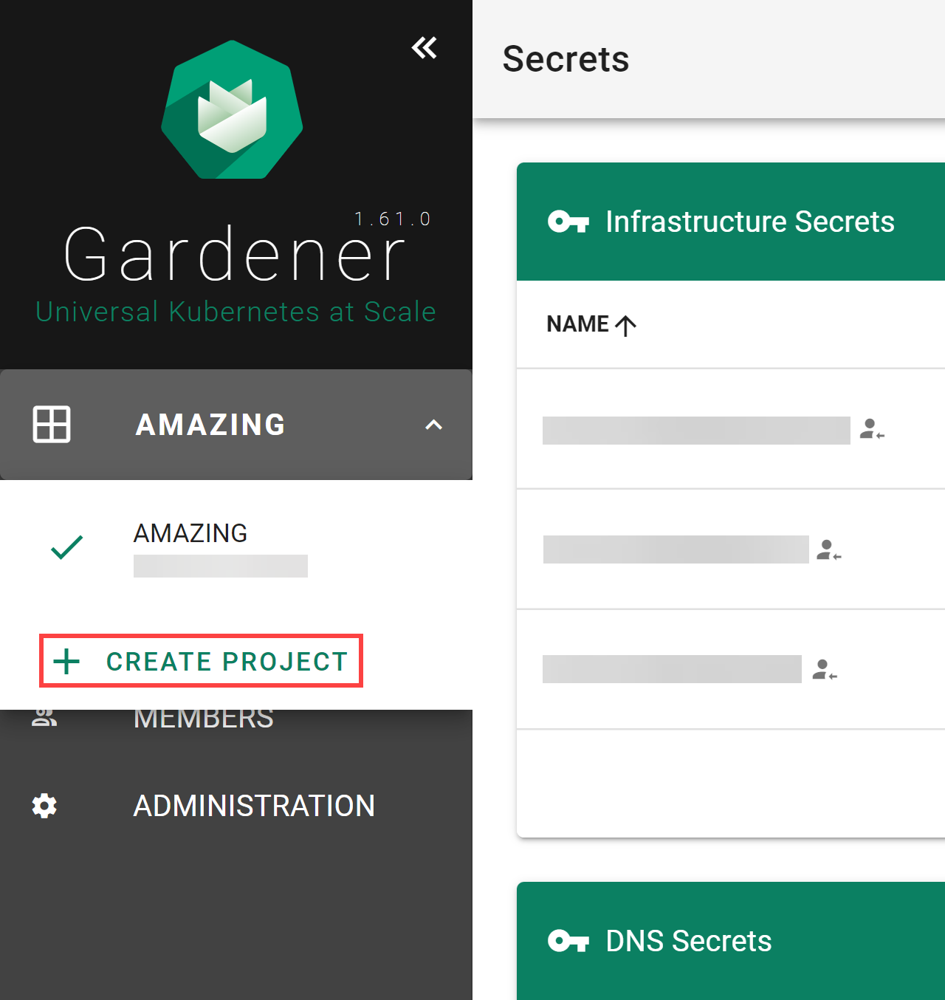

# Working with Projects

**Projects** are used to group clusters, to onboard IaaS resources utilized by them and organize access control. 
To work with clusters, you need to create a project that they’ll belong to.

### Prerequisites
- You have access to the Gardener dashboard and have permissions to create projects.

### Procedure

1. Log on to the Gardener Dashboard and choose **CREATE YOUR FIRST PROJECT**.

    
    
2. Provide a project **Name**, and optionally a **Description**, and a **Purpose**, and choose **CREATE**.

    **Note:** You will **not** be able to change the project **Name** later. The rest of the details are editable.

    

    The result is similar to the following:

    

    If you need to create more projects, expand the projects list dropdown on the left. When expanded, it reveals a **CREATE PROJECT** button that brings up the same dialog as above.

    

    When you need to delete your project, go to **ADMINISTRATON**, choose the trash bin icon and, confirm the operation.
    
 
